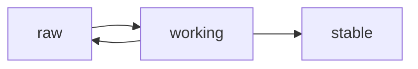

This repository contains a merger of personal notes, documentation, and an R project to help convert some elements to an online format. It is primarily focused on the Obsidian-rooted *zettlekestan* method.

# Folders

There are several folders for organization that serve difference purposes

| Folder | Contents |
| - | --- |
| docs | uploaded to internet in HTML |
| drafts | pending polish |
| literature | Zotero-integrated article annotations |
| permanent | notes intended for long-term growth |
| resources | images and files referenced in notes |
| templates | Obsidian templates |
| temporary | brief notes that are fleeting |

The literature file uses Zotero-integrated articles, which are annotated as I read them, based on [Zotero-guide](permanent/Zotero-guide.md).

# Note Classification

## Categories

| Category | Description |
| - | --- |
| structure | scaffolds other notes |
| concept | single/focused atomic idea |
| project | topic-specific, temporal, building work |
| reference | reference material |

## Stage

`stage` tracks a note's maturity, using three values:

| Stage | Indication |
| - | --- |
| raw | forming — fleeting capture or early outline |
| working | actively developed and being refined |
| stable | settled; no major changes expected |

```mermaid
flowchart LR
	raw --> working
	working --> stable
	working --> raw
```

Notes put on hold are marked with an `#on-hold` tag rather than a `stage`, since priority is separate from maturity.
