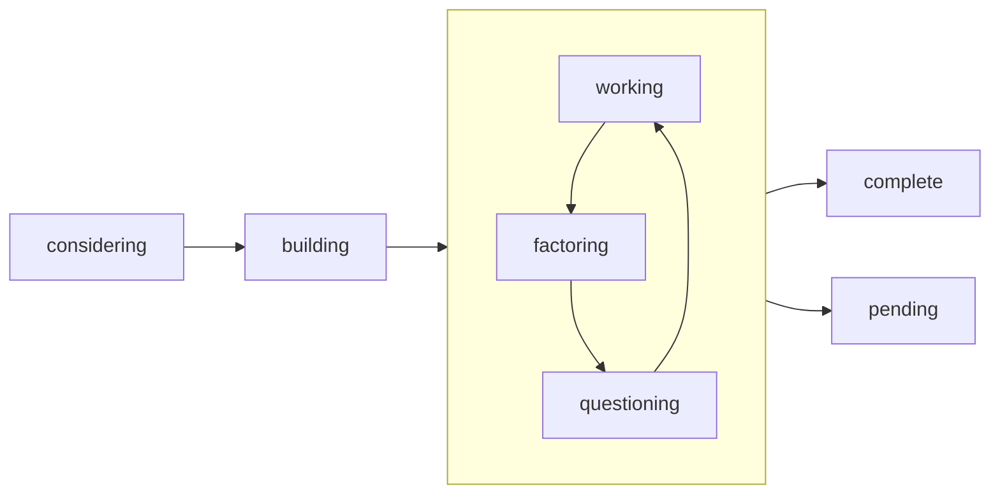

This repository contains a merger of personal notes, documentation, and an R project to help convert some elements to an online format. It is primarily focused on the Obsidian-rooted *zettlekestan* method.

# Folders

There are several folders for organization that serve difference purposes

| Folder | Contents |
| - | --- |
| docs | uploaded to internet in HTML |
| drafts | pending polish |
| literature | Zotero-integrated article annotations |
| permanent | notes intended for long-term growth |
| resources | images and files referenced in notes |
| templates | Obsidian templates |
| temporary | brief notes that are fleeting |

# Note Classification

## Categories

| Category | Description |
| - | --- |
| structure | scaffolds other notes |
| concept | single/focused atomic idea |
| project | topic-specific, temporal, building work |
| reference | reference material |
| meta | notes on **how** notes/objects/etc are written |

## Stage

The following stages are ways to help identify where a document exists in its life-span. They are listed alphabetically below and not in the order of how they should be used.

| Stage | Indication |
| - | --- |
| considering | initialization of note |
| building | development of outline elements |
| working | active and overall note |
| factoring | simplification of note |
| pending | held or reserved, lower priority |
| complete | no longer expecting updates |
| questioning | consideration for refactoring |

Instead, here I have a working diagram of how I expect the stages to be cycled through.

