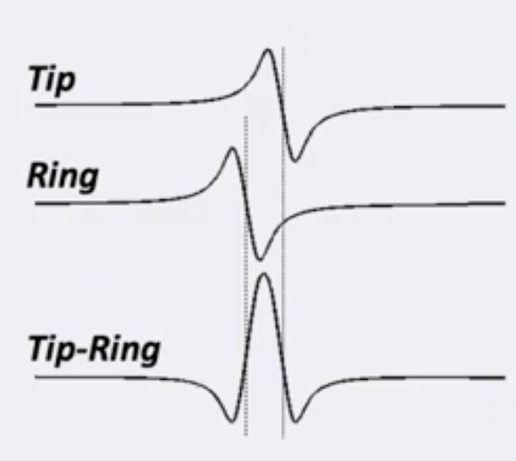

Based on the bipolar signal seen, in relation to the unipolar signal, what direction is the wavefront coming?

---

Assuming it is in parallel, the wavefront must be going away from  the bipolar, based on how bipolar EGMs are generated.

$$
EGM_{bipolar} = EGM_{unipolar_{distal}} - EGM_{unipolar_{proximal}}
$$

Source: [unipolar-and-bipolar-electrograms](../../../permanent/unipolar-and-bipolar-electrograms.md)