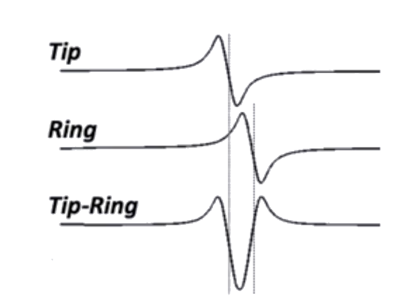

Based on the bipolar signal seen, in relation to the unipolar signal, what direction is the wavefront coming?

---

The wavefront must be coming towards the bipolar, arriving at distal then proximal, giving the rSr' pattern.

$$
EGM_{bipolar} = EGM_{unipolar_{distal}} - EGM_{unipolar_{proximal}}
$$

Source: [unipolar-and-bipolar-electrograms](../../../permanent/unipolar-and-bipolar-electrograms.md)