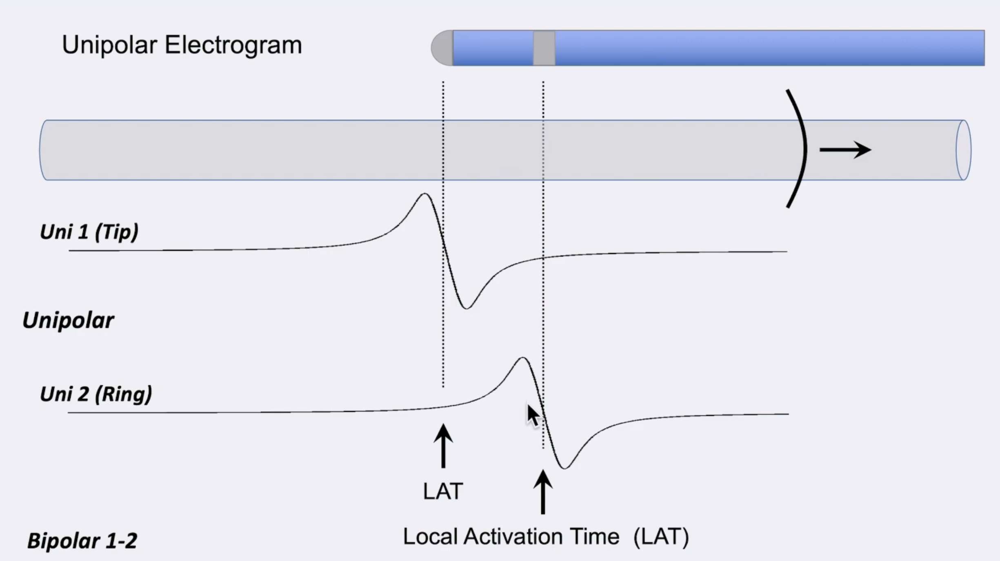
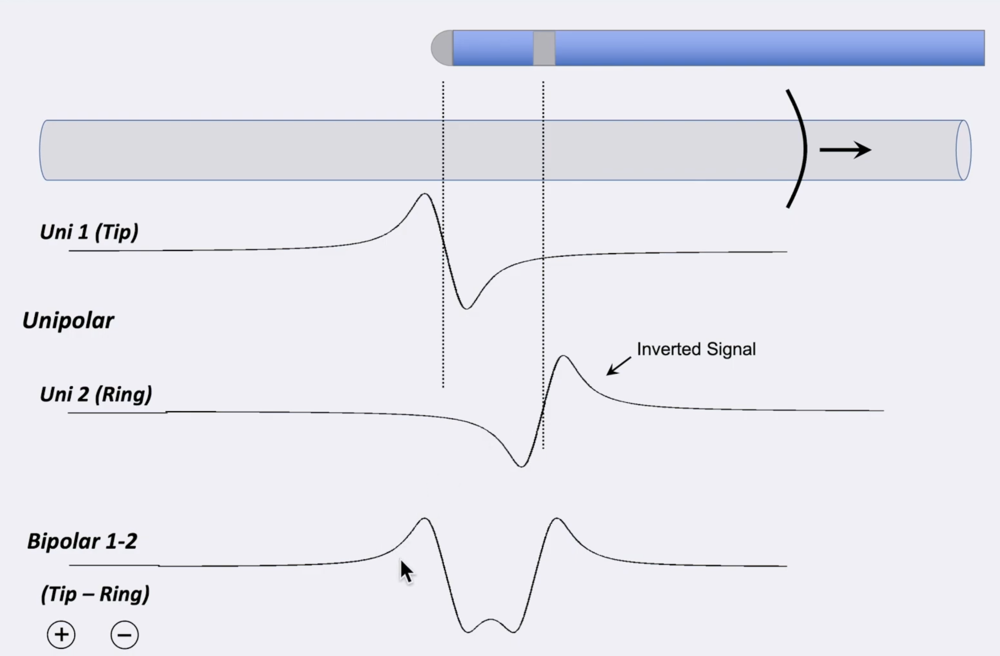

How is the bipolar EGM generated?

---

The ring unipolar signal (-) is essentially substracted from the tip unipolar signal (+)  
  
Equivalent of inverting the ring signal and adding that waveform to the tip waveform recording.

Source: [unipolar-and-bipolar-electrograms](../../../permanent/unipolar-and-bipolar-electrograms.md)