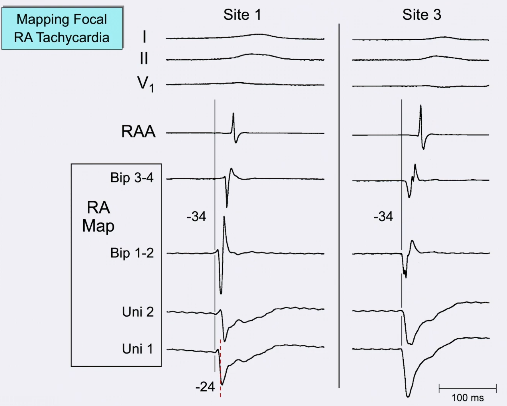

In the setting of a focal arrhythmia mechanism, what three criteria are required to determine site of earliest activation?

---

1.  Near-field activation is as early as the earliest far-field activation seen on any EGM
1. Distal bipolar recording and unipolar recording begin simultaneously, *which indicates no earlier far-field activation*
1. Morphology of distal unipolar is `Qs` pattern

Source: [unipolar-and-bipolar-electrograms](../../../permanent/unipolar-and-bipolar-electrograms.md)