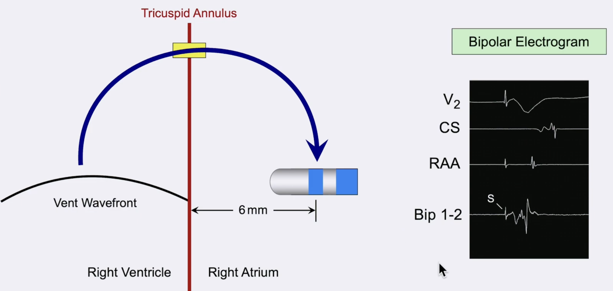

On the distal bipole of the recording catheter, what are the components of the waveform?

---

The initial component is the far-field ventricular signal (just after the V-stimulation artifcation). The sharp terminal signal is the atrial signal and is underneath the bipole.  

Waveform amplitude reflects the amount of tissue, not its proximity to the recording bipole.

