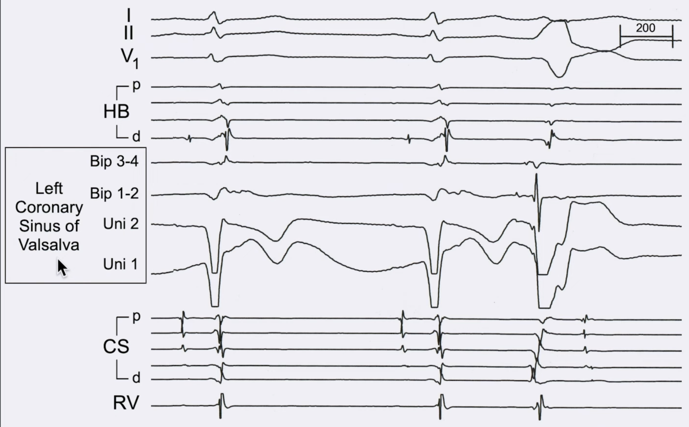
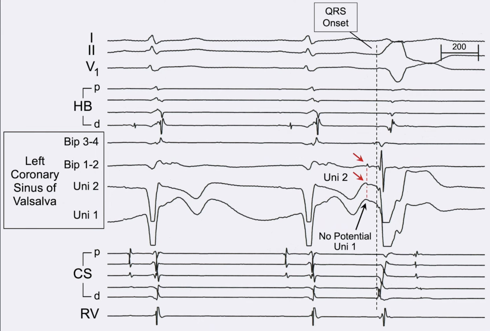

Should ablation for the LVOT PVC be performed here?

---

No, as the bipolar pre-potential is actually generated using the proximal unipolar signal, and not the distal tip. 
The catheter needs to be pulled back.

Source: [unipolar-and-bipolar-electrograms](../../../permanent/unipolar-and-bipolar-electrograms.md)