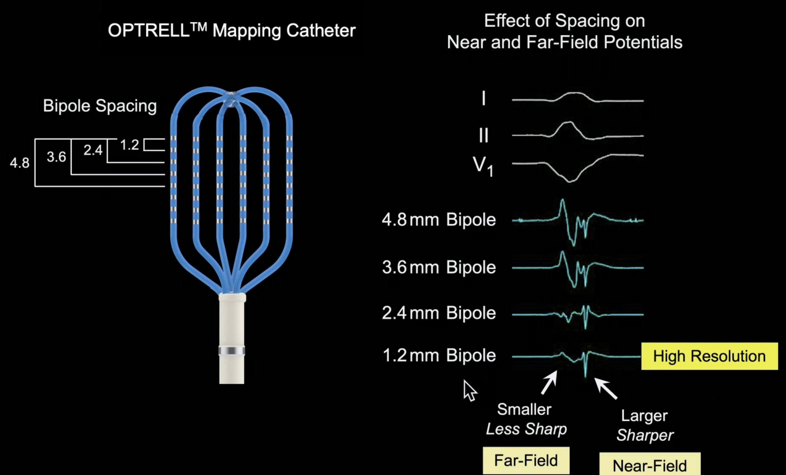

These are 4 bipolar recordings made at the same spot in a ventricular scar, with different spacing. What is the pattern seen and why?

---

The top recording is wider spacing, while the bottom recording is the most narrow spacing, which is why we have decreased far-field signal and higher resolution, sharper near-field signal.

