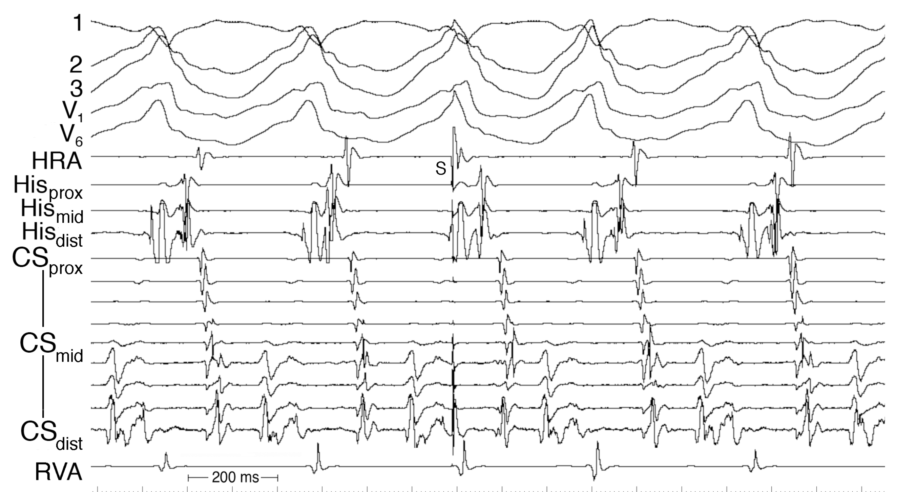
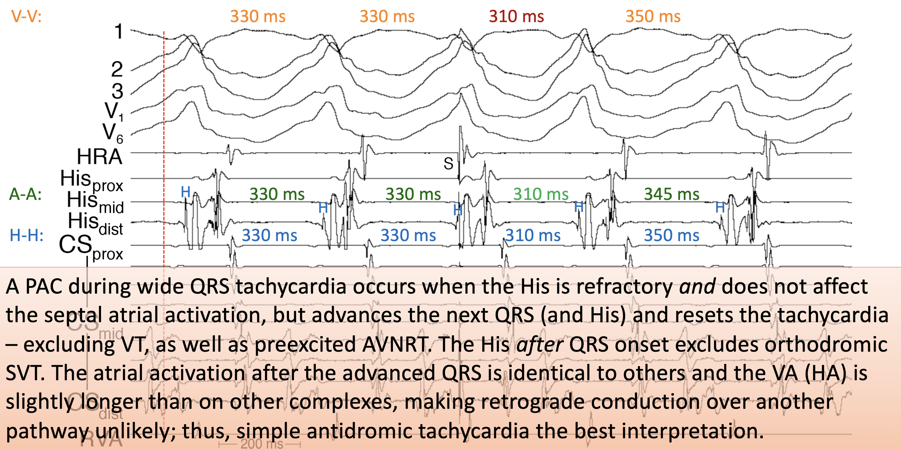

What are the two potential mechanisms for VA conduction after the stimulated PAC?

---

Retrograde AV node conduction, or potentially bystander pathway

Source: [antidromic-avrt-examples](../../../permanent/antidromic-avrt-examples.md)