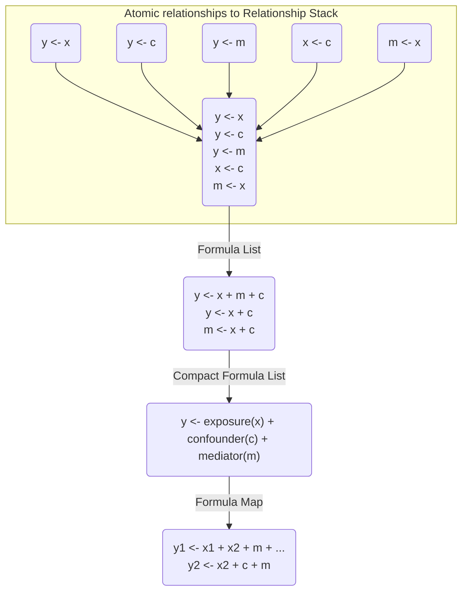
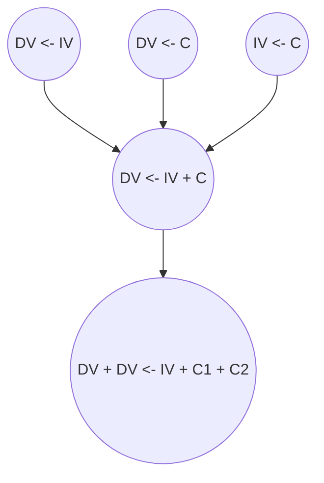
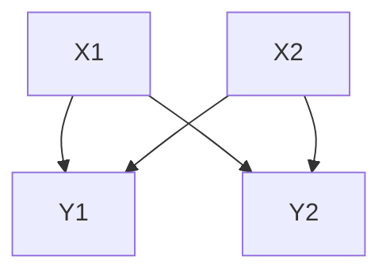
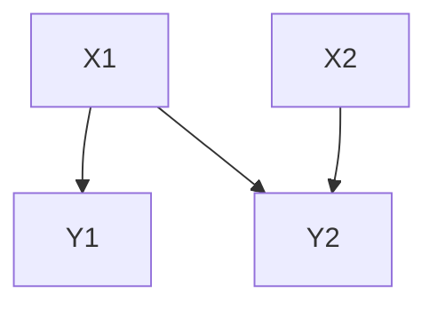

# Overview

1. Formulas should have roles/positions to help identify their roles in the corresponding DAG. These formulas should also be _expandable_ as needed to encompass the variety of relationships. 
1. Formulas should have multiple levels.  Essentially should have a "top level" formula that can be broken into separate or related DAGs. This is probably the back-bone structure.
1. DAG should be visualized with both weights (like SEM), and unweighted, to understand relationships. This might best be done based off of `ggdag` and `dagitty` as the backbone. 
1. Model and model lists are also needed. They are essentially the _fit_ version of the formulas and have an additional, associated test type. 
1. Models cannot have a the same scope as the "top level" formula, they must be simplifed to a single testable item. However, they can likely be grouped into model lists that are related.

### Key Concepts

| Concept |  Models | Formulas |
| --- | --- | --- | 
| Relationships | Multiple | Multiple |
| Expandable | Yes | Yes |
| Collapsable | No | Yes |
| Directionality | Specified | Specified |
| Levels | Multiple | Multiple |
| Core | No | Yes |

# Major Classes

The major classes that would be needed are...

- Formula List (a clean way to combine formulas for a shared interspace)
- Paths (a combination of formula lists that represent a hypothesis or causal model)
- Maps (a combination of paths that may come from the same data set)

# Approach

This is a development / exploration of what classes would be needed and what characteristics would be required for an effective causal modeling approach.



# Classes
## Atomic Relationships

```r
y ~ x
```

Requirements:
- pattern would only be for a single relationship between independent and dependent variables
- there should be no other terms included

## Relationship Stacks

```r
y ~ x
y ~ c
y ~ m
x ~ c
m ~ x
```

Requirements:
- specific/special list classification 
- each list item would need to be an atomic relationship

## Formula Lists

```r
y1 ~ ...
y2 ~ ...
```
## Compacted Formula Lists
```r
y ~ X(x) + C(c) + M(m)
```

## Formula Maps

```r
y1 ~ ...
y2 ~ ...
```


__Note__: The development of the `formula` classes that are related to DAGs ended up splitting up into an additional package. 

# Requirements

The `formula` in R is essentially a language/list object with three components. It has a LHS, RHS, and an operator in between. It allows for terms on the right and the left that can have specific operators to manipulate them, e.g. `+` for adding terms. To create this more complex system, additional requirements will be needed.



There are multiple levels here.

1. Atomic level of relationships. This should only be two variables. This has to be contextualized as part of a "family" of atomic relationships however. 
1. Standard formula of relationships. The next level would be combination formulas that are at the level of which they could be tested. If it was a mediation question, then the formula would have to be a set of structured equations.
1. Parent formula complex. This uses labels to help identify how the exposures and outcomes are related (e.g. in combination, etc). If this starts off as a DAG, it may end up being "sets" of formulas. If its an equation, then it would not be possible to identify which exposures go to which outcomes.***

*** `Y1 + Y2 ~ X1 + X2` would lead to a different set of equation relationships. A DAG however may only include a subset.

This shows how the DAG may look if the parent formula was described first.



If the DAG was made first, and was not equivalent, would decompose into something different.



This could not be represented easiy in a single formula, e.g. `Y1 + Y2 ~ X1 + X2` misrepresents the relationship. Instead two equations would be needed.
1. `Y1 ~ X1`  
1. `Y2 ~ X1 + X2` 

The parent level here is thus still a "set" of equations that can transition between being a DAG and a set of formulas. 

# Implementation

Starting with the parent level of this "dag/formula" object, we need to decide what will be the basic and default structure. A formula-list is probably the correct system to use.  

```r
# Example of a complex formula
y1 + y2 ~ x1 + x2 + c1 + c2

# This needs to be split into two outcomes at least
y1 ~ x1 + x2 + c1 + c2
y2 ~ x1 + x2 + c1 + c2

# Or can be split by exposures
y1 + y2 ~ x1 + c1 + c2
y1 + y2 ~ x2 + c1 + c2
```

The minimum number of components of the formula-list needs to be the compatible components of a DAG that can be modeled. Thus, a relationship set with two outcomes must be split apart. Also, must be split by exposure.

To do this, the central feature that identifies a formula-list must be an __exposure-outcome__ relationship. The input to the system can be of two major types:

1. DAG (or unidirectional path graph)
1. Complex formula
