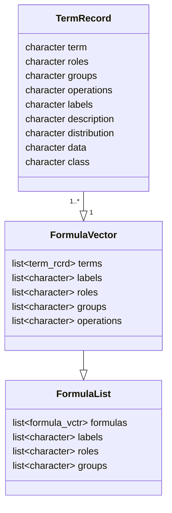

This is a brainstorming area for the [[forks-package]] that is under development.

# Formulas 

In the traditional formula, as seen in `R`, the capabilities include:

- directly identifies the independent and dependent variables 
- models to be built/informed
- data selection (e.g. vectors/columns) along with data transformation
- terms can be modified and some interaction/relationships can be implemented

The capabilities that traditional formulas are missing:

- variable roles within relationships of formulas
- nested/grouped formulas that represent a modeling concept (e.g. mediation, confounding)
- stratification of data
- hierarchical formulas (such as random effects)
- formula expansions and combinations

# Structure

This diagram is to help identify the structures needed in the development of an improved formula system.

## Terms

`term` objects have specific attributes that modify the `character` class in `R`...

| Attributes | Description |
| --- | --- |
| side | eventual side of an equation or formula (e.g. LHS, RHS) |
| role | epidemiological positions, such as exposure, outcome, predictor, covariate, confounder, mediator, or more complex modeling terms such as strata or random/effect effect |
| group | if terms are related to one another, they may be grouped together |
| operation(s) | such as `log()` transformation |
| label | an abbreviated character string for variable display |
| description | explanation of a variable if needed, particularly as part of or from a data dictionary |
| distribution | the pattern of how the data is expected to be (or how the data happens to be), could also be a verification step |
| class | expected character time | 
| data | if a vector of a data is added to this from a data set, can be stored with the term, or could also come from turning a data-set into terms |

Each `term` is essentially a *promise* or *contract* with the data set that contains additional information to help understand the data better, and use it in hypothesis generation.

## Formulas

Formulas are combinations of underlying terms in some order, broken roughly into three parts...

1. LHS or outcomes
2. RHS or predictors
3. Special terms such as random effects, strata, or conditioning/clustering variables

As these formulas have terms that have specific roles, such as multiple outcomes or multiple predictors, they cannot be used directly unless expanded into an appropriate formula (that can be fit). 

This is the core feature, a `formula` class that has built-in specifications of how to manipulate and show the *relationship* of the terms together.

## Formula Lists

The expanded formulas are true formulas that can be utilized in regression modeling or statistical testing. The list itself could also contain attributes about the underlying terms (e.g. labels, groups, roles). This could subsequently be used to help decide on how these formulas should be fit.

## Model Lists

Multiple models can be linked together in some pattern to help understand a concept or physiology. This family of models could/should have informative attributes, such as model terms, 