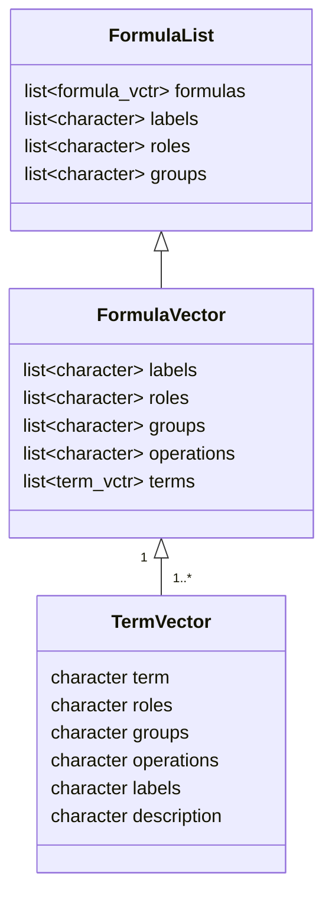

# Formulas 

In the traditional formula, as seen in `R`, the capabilities include:

- directly identifies the independent and dependent variables 
- models to be built/informed
- data selection (e.g. vectors/columns) along with data transformation
- terms can be modified and some interaction/relationships can be implemented

The capabilities that traditional formulas are missing:

- variable roles within relationships of formulas
- nested/grouped formulas that represent a modeling concept (e.g. mediation, confounding)
- stratification of data
- hierarchical formulas (such as random effects)
- formula expansions and combinations

# Structure

This diagram is to help identify the structures needed in the development of an improved formula system.

## Terms

`term` objects have specific attributes that modify the `character` class in `R`...

- role: epidemiological positions, such as exposure, outcome, predictor, covariate, confounder, mediator, or more complex modeling terms such as strata or random/effect effect
- group: if terms are related to one another, they may be grouped together
- operation(s): such as `log()` transformation
- label: an abbreviated character string for variable display
- description: explanation of a variable if needed, particularly as part of or from a data dictionary 

## Formulas

## Formula Lists

## Model Lists