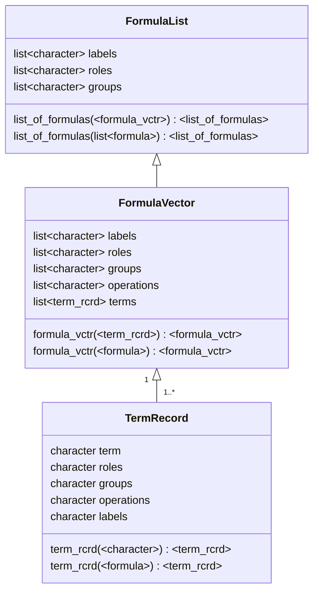

# Formulas 

In the traditional formula, as seen in `R`, the capabilities include:

- directly identifies the independent and dependent variables 
- models to be built/informed
- data selection (e.g. vectors/columns) along with data transformation
- terms can be modified and some interaction/relationships can be implemented

The capabilities that traditional formulas are missing:

- variable roles within relationships of formulas
- nested/grouped formulas that represent a modeling concept (e.g. mediation, confounding)
- stratification of data
- hierarchical formulas (such as random effects)
- formula expansions and combinations

# Structure

This diagram is to help identify the structures needed in the development of an improved formula system.

