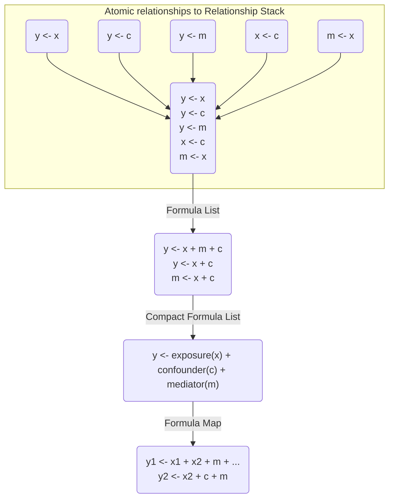

# Approach

This is a development / exploration of what classes would be needed and what characteristics would be required for an effective causal modeling approach.



# Classes
## Atomic Relationships

```r
y ~ x
```

Requirements:
- pattern would only be for a single relationship between independent and dependent variables
- there should be no other terms included

## Relationship Stacks

```r
y ~ x
y ~ c
y ~ m
x ~ c
m ~ x
```

Requirements:
- specific/special list classification 
- each list item would need to be an atomic relationship

## Formula Lists

```r
y1 ~ ...
y2 ~ ...
```
## Compacted Formula Lists
```r
y ~ X(x) + C(c) + M(m)
```

## Formula Maps

```r
y1 ~ ...
y2 ~ ...
```