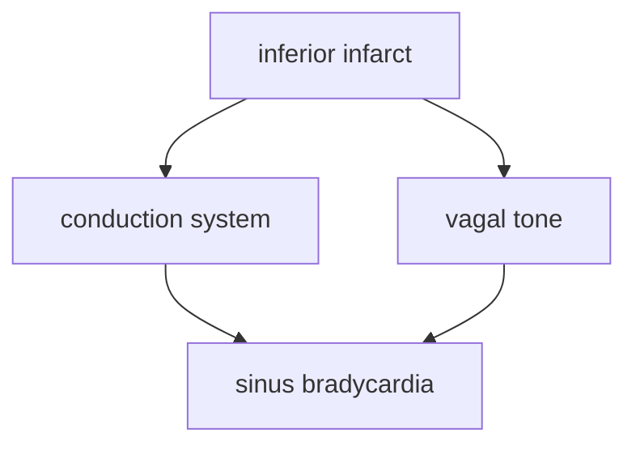

Bradycardia may be from both vagal tone and ischemia of the conduction system. 

```mermaid
flowchart TD

RCA[inferior infarct] --> ECG[conduction system]
RCA --> ANS[vagal tone]
ECG --> SB[sinus bradycardia]
ANS --> SB


```

