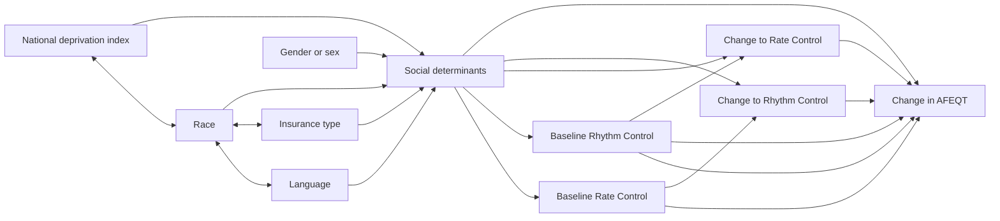

This project was initialized during [[T32 and F32 Research Years]].

# Overview

This analysis started as a "leftover" from the initial work previous lab members in the lab of  [[Dawood Darbar, MD, MBChB]]. 
The work was initially about 400 patients with baseline and follow-up AFEQT, however the paper languished for a few years and was revived in 2023.
We have exppanded that dataset by several hundred patients, including those at UIC and the JBVA, and importantly feel that this is a timely cohort to describe.
Our overall hypothesis was that [[Social Determinants of Health]] would drive part of the treatment decisions and outcomes in patients with AF.

Generally, we have the follow variables.

Exposures:
-	NDI, quartiles 
-	Race/Ethnicity
-	Language
-	Insurance
-	Gender/Sex

Outcomes:
-	AFEQT score changes
-	Treatment escalation (increased dosage)
-	Change from rate to rhythm control strategy
-	Referral for intervention (EP, TEE, PVI)
-	Anticoagulation recommendations (DOAC v. warfarin) ... this can be viewed as the initial cross-sectional recommendation as well as at time of follow-up

Confounders:
- Age
- CHA2DS2VASC score
- Clinical comorbidities, particularly focused on CVD/AF risk factors
- Stroke, previous or new
- Baseline rhythm or rate control strategy
- Baseline medication choices (including DOAC)

From preliminary data, we believe that the AFEQT score changes are *obviously* related to baseline AFEQT scores.
But, the factors that predict changes in AFEQT are theoretically related to treatment. 

When thinking of this data from a DAG perspective, the relationship between the SDOH factors and the outcome, it appears that the treatment strategies are potential mediators for this relationship. 

# Analytical Plan

Going back to the DAG, albeit not truly acyclic, what is presumed as directly *causal* of improvements in AFEQT are the rate and rhythm control strategies.
SDOH however may affect the choice for treatment, and thus, treatment is potentially a mediator. 
Not only that, the SDOH factors may also interplay on themselves, leading to exposure-level interactions.

The general analyses I would propose to showcase this are:

- Direct relationship between treatment strategies and AFEQT outcomes
- Direct relationship between SDOH and AFEQT outcomes
- Direct relationship between SDOH and treatment strategy choices
- Mediation analysis of SDOH and AFEQT, with mediator being rate/rhythm strategies?
- Interaction between SDOH and SDOH components

# Tables & Figures

The figures and tables for this paper need to be thoughtful analyses of the major relationships we hope to show.

1. Table = cohort description by baseline AFEQT scores, with sections on clinical covariates, social determinants, etc
1. Table = Cohort description with statistical testing by AFEQT score changes
1. Figure = AFEQT score breakdown in the population, with subscales (bar graph), showing score changes
1. Table = regression model for SDOH factors and AFEQT change
1. Table = mediation analysis for SDOH factors, treatment strategies, and AFEQT scores
1. Figure = forest plot of interaction of the __highest yield__ SDOH marker and AFEQT score changes

## Table 1: Cohort Description

Potential ideas
- Key grouping by at time of AFEQT baseline
- Rate versus rhythm control strategy 
- Divide by major outcome of AFEQT score change (not standard approach)

## Table 2: AFEQT Scores

Would need to break down by AFEQT score subtype

## Table 3: Predictors of AFEQT Change

## Table 4: NDI Association with AFEQT Change
