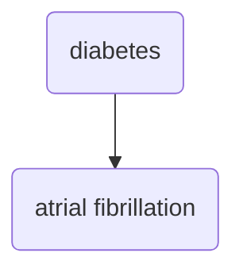

Working with a student on DM and AF prediction.

Similar to [carrs-diabetes-and-cardiotoxicity-in-south-asians](carrs-diabetes-and-cardiotoxicity-in-south-asians.md) project, except instead of looking at global *fibrosis* we are evaluating different pathways:

1. Autonomic paths through cardiac autonomic neuropathy
2. Atrial pressure abnormalities through diastolic dysfunction

#afib 
#diabetes 
#electrocardiogram 
#echocardiography
