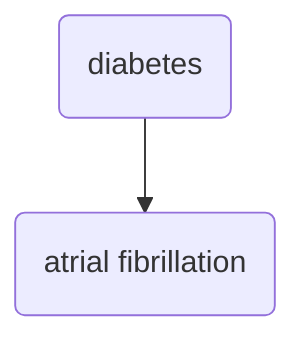

Working with a student on DM and AF prediction.

Similar to [[../permanent/Global Electrical Heterogeneity and Diabetes Mellitus in CARRS|Global Electrical Heterogeneity and Diabetes Mellitus in CARRS]] project, except instead of looking at global *fibrosis* we are evaluating different pathways:

1. Autonomic paths through cardiac autonomic neuropathy
2. Atrial pressure abnormalities through diastolic dysfunction

#afib 
#diabetes 
#electrocardiogram 
#echocardiography
