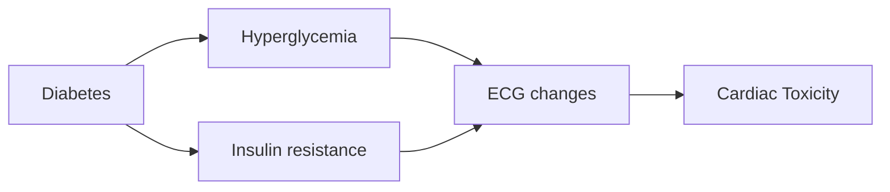

This project was started during the TL1 award and continued during [[T32 and F32 Research Years]]. 

# Introduction

The CARRS study (**C**entre for c**A**rdiometabolic **R**isk **R**eduction in **S**outh-Asia) is described in @Nair2012. 
It's purpose was initially to evaluate the role of risk factors for cardiovascular disease progression in South Asian (primarily India). 
We proposed to evaluate the role of cardiotoxicity from diabetes to help explain some of the additional risk, focusing on the effect of hyperglycemia and insulin resistance on global electrical heterogeneity.

This is an ongoing project.

# Methods

## Study Overview

-   Subset of CARRS that have ECG data
-   Exposure = diabetes status
-   Outcome = ECG changes measured by global electrical heterogeneity (GEH)
-   Covariates = insulin resistance, obesity, age, sex, hypertension, cardiovascular dz
-   Model relationship with consideration of potential modifiers, confounders, and interaction terms

## Study Measures

-   Diabetes defined by FBG, A1c, or treatment
    -   FBG \>= 126
    -   HbA1c \>= 6.5%
    -   HOMA = (insulin mU/L / 6 \* FBG mg/dL) / 405 ... marker of insulin resistance [@Matthews1985]
-   Obesity
    -   **BMI**
        -   underweight: \< 18.5
        -   normal: \>= 18.5 & \< 23
        -   overweight: \>= 23 & \< 27
        -   obese: \>= 27
    -   Body fat percentage (potential): impedance, skin fold measurements
-   Hypertension (AHA): SBP \>= 130, diastolic \>= 80, or treatment
-   Coronary dz: reported or document hx of heart dz
-   Age
-   Sex

## ECG overview

ECG collected on CARRS patients from Delhi, converted to XML for processing, an GEH parameters were created.[@Waks2016] GEH:

- SVG magnitude
- spatial QRST angle

Additional Parameters:

- QT intervals
- RR intervals
- Wilson's vector gradient

## Statistical Analysis

- descriptive/frequentist statistics of cohort clinical and GEH parameters
-  unadjusted linear regression models
-  adjusted linear regression models
-  analysis of impact of additional covariates on GEH parameters
-  causal analysis of insulin resistance and acute hyperglycemia

# Analysis Plan

The first table should be just a description of the cohort, of just CARRS1, based on the causal model.
The main outcome are the above ECG characteristics, while the main exposure will be characteristics of diabetes. 

In this simplified model, I hypothesize that chronic hyperglycemia leads to cardiac fibrosis, which in turn leads to the cardiotoxic effects of diabetes.
Diabetic cardiotoxicity would be similar to other fibrotic processes, such as cardiac amyloidosis - albeit we cannot compare diabetes to amyloid so directly or strongly.
The cardiac fibrosis pattern seems to be diffuse repolarization abnormalities, such as widening of the QRS-T angle, and the decreasing in overall voltage. 
The preliminary work from 2020 fits this pattern.

1. The first step would be to have a simple cohort description between diabetics and non-diabetics.
1. Show the relationship between diabetes status and ECG markers directly, regardless of medication or glycemic control.
1. Then, evaluate the concept of insulin resistance versus chronic hyperglycemia, using A1c and HOMA as comparative models.
    1. Can evaluate the interaction between A1c and HOMA as well.
1. Treatment effect is important. Understanding if the observed ECG changes are mediated by drug therapy is important. Mediation analysis with drug therapy.
1. Test interaction by drug effect if present
1. Prove linearity with spline analysis and ECG changes

#diabetes
#electrocardiogram 
#epidemiology 
#manuscript 