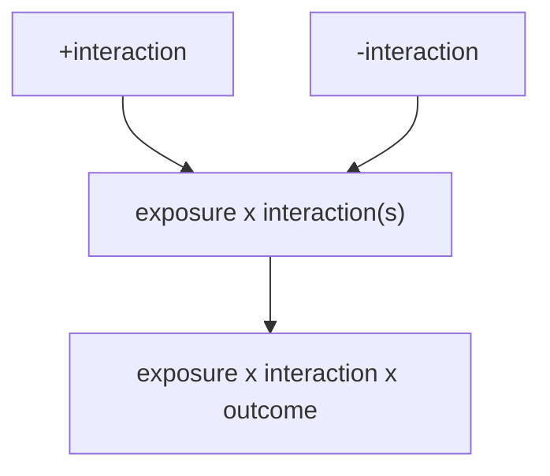

In the [R-vlndr](R-vlndr.md) package, the data needed to create forest plots is available. However, the structure of the forest plot are complicated. This note describes forest plots using interaction variables.

First, we find the effect of interaction, e.g. [interaction-effect-estimation](interaction-effect-estimation.md), on the multiple levels of the interaction term. 

To visualize this, the following elements are needed.
- Requires a single exposure and single interaction that would essentially make two rows of a plot
- Multiple interaction variables across a single exposure would make a column
- This column of exposure x multiple interactions would have a single outcome
- Additional outcomes or additional exposures would create other columns 

The rows are proportional to the number of interactions being assessed: assuming that the $exposure \rightarrow outcome$ is the focus, covariates will be tested for interaction (e.g. subgroup analysis by covariate).
The columns are proportional to the number of exposures.
Then, each section of the table is proportional to the number of outcomes.

$$
\begin{align}
row &\propto interaction_{i} \\
column &\propto exposure_{j} \\
section &\propto outcome_{k}
\end{align}
$$

#programming 
#software 
#statistics 