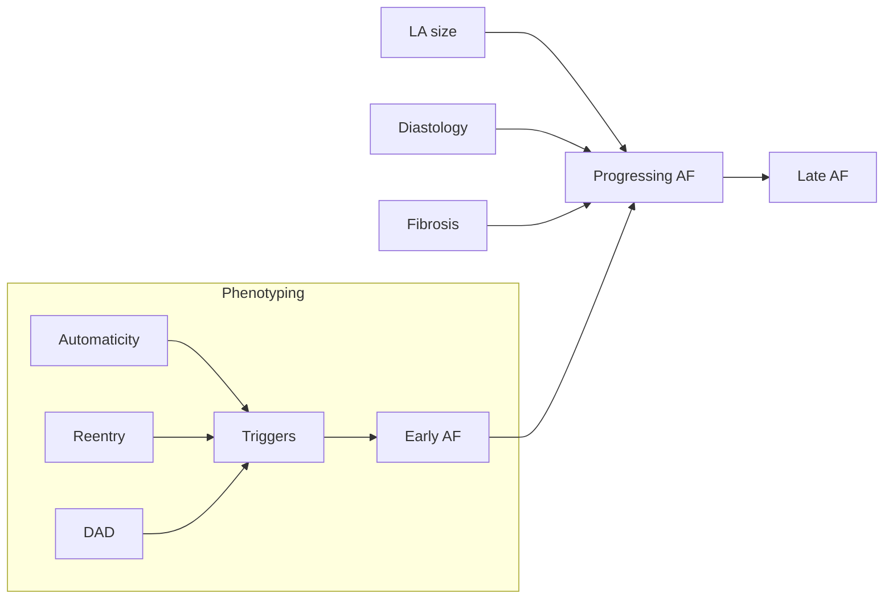

## Phenotyping

__Paroxysmal__ AF requires both a trigger and a substrate to progenerate. 
Paroxysmal, early AF rallies primarily through triggered activity
Electrical abnormalities preceed ± cause mechanical changes (fibrosis, myocardial disarray, leading to increased pre-disposed substrate.
Long-standing, chronic/persistent AF sustains primarily through substrate.
Firing mechanisms occurs primarily from pulmonary veins due to:

 -   Enhanced automaticity
 -   Myocardial micro-reentry
 -   Triggered activity

However, phenotyping is lmited.
E.g. PhenoKB uses binary diagnosis of AF (2012), while recent studies showed up to four potential clusters may exist. [@Pastori2020; @Vitolo2021]

1. Younger, lower comorbidities
2. High CV risk factors
3. High CV comorbidities
4. High rates of non-CV comorbidities (e.g. cancer)

## Autonomic influences

- Genetic variants that affect autonomic function along the neurocardiac axis may interplay with known inherited arrhythmis, such as the vagal-mediated triggers of SCD in LQTS patients
- Chronic VNS reduces drop in ejection fraction in different animal models of cardiomyopathy, including MI, but studies have mixed results in humans
	- NECTAR-HF ~ VNS or sham, no difference at 6 months in LV size/function, n = 96
	- INOVATE-HF ~ right VNS + GDMT vs. GDMT, no difference in mortality, n = 700
	- ANTHEM-HF ~ non-randomized VNS, improved LV function, pilot study (*required titrated VNS to cause decrease in HR*)
- VNS may be anti-arrhythmic in animal models, with decreased VT/VF, but minimal human studies
	- GANGLIA-AF, paroxysmal AF randomized to PVI or atrial GP ablation, decreased AAD dosages in GP group, n = 102
- Arrhythmia thresholds affected by sympathetic and vagal activity 
	- Intracardiac cross-talk between adrenergic (sympathetic) and cholinergic (vagal) neurons in the hierarchy of neurocardiac axis is critical for arrhythmogenesis during mental stress
	- Atria are heavily innervated by autonomic ganglionic plexi, leading to the complex activity that regulates cardiac conductive properties[@Hoover2009; @Armour1997] 
- Sympathetic nervous activity is slower onset, but vagolysis is rapid, thus being a more likely causal component of arrhythmogenesis
	- Sympathetic/adreneric neurons release catecholamines (NE) that directly affect the myocardium
	- NPY and galanin is also released, which both inhibit cholinergic activity [@Herring2012; @Herring2015a]
	- Both inhibit firing and leading to vagolytic effects on the myocardium [@Kalla2020; @Herring2008] 
		- Galanin released as a adrenergic co-transmitter, binding to GalR1 receptors
		- NPY binds to cholinergic neurons through the Y2 receptor
		- Both directly/indirectly involve protein kinase C
	- NPY receptors exist along the neurocardiac axis, including adrenal medulla (Y3) and cardiac tissue (Y2)[@Coote2013]

## Genetic factors