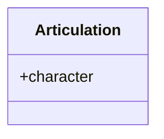

This is a concept page from the main software [R-rmdl](R-rmdl.md). 
The concept of an `articulation` is the underlying joinery between outcome and exposure (or any other predictor). 
The concept needs to be cover the contexts it may exist in to help create the `{gt}` tables for publications.
Here we brainstorm how to put that together.

Direct relationships:

A majority of direct relationships will be based on the 1) type of modeling approach, and 2) variable type.

Continuous ~ Binary | Categorical

Binary ~ Continuous

Binary ~ Binary | Categorical

Categorical ~ Continuous

Categorical ~ Binary | Categorical

Variable types:

- continuous
- categorical (ordered or unordered)
	- binary
	- multiple categories

Direction relationships:

- model estimates
- means
	- adjusted (e.g. `{emmeans}`)
- distributions

Contexts:

Sequential adjustment: 
	- The major exposure or predictor (in relationship to the outcome), referred here as an `articulation` is in a model multiple times due to sequential adjustment, each adjustment layer is an additional *context*
	- Each *context* here is ordered based on the sequence of covariates, e.g. rows in a column for repeated, sequentially-adjusted models

- strata
- interaction
- dataset differences
- covariates
	- sequential adjustment

# Visual Elements

An important aspect of presenting data is grouping of variables. 
These groups are not necessarily how modeling is performed, but how the table organizes variables.