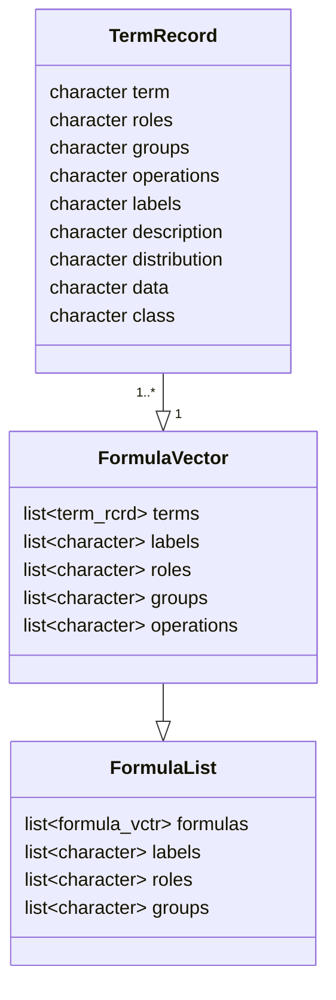
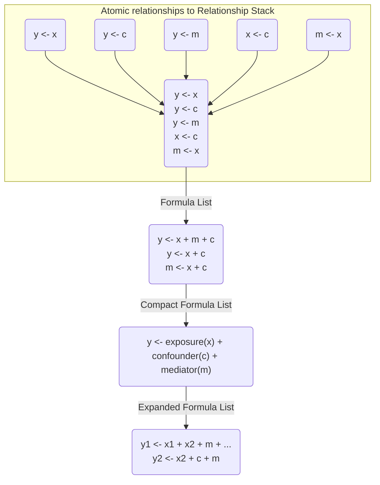
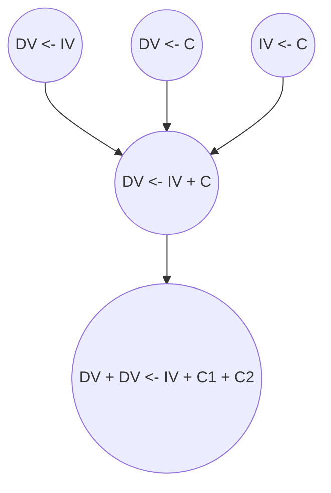
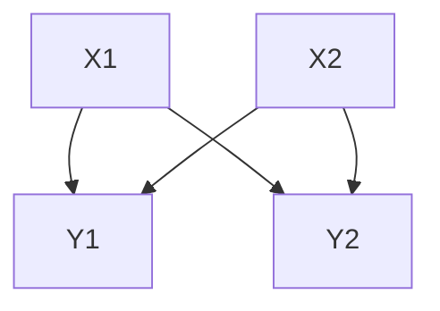
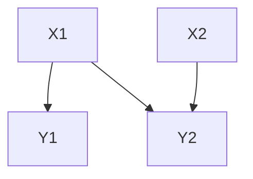

# Major structural classes

To pursue this project, several new classes would need to be generated. 
I dive into how to consider and think about them here. 
These are not necessarily formalized in the draft package, but are part of the development process.

Major concepts:

1. Formulas should have roles/positions to help identify their roles in the corresponding DAG. These formulas should also be _expandable_ as needed to encompass the variety of relationships. 
1. Formulas should have multiple levels.  Essentially should have a "top level" formula that can be broken into separate or related DAGs. This is probably the back-bone structure.
1. DAG should be visualized with both weights (like SEM), and unweighted, to understand relationships. This might best be done based off of `ggdag` and `dagitty` as the backbone. 
1. Model and model lists are also needed. They are essentially the _fit_ version of the formulas and have an additional, associated test type. 
1. Models cannot have a the same scope as the "top level" formula, they must be simplifed to a single testable item. However, they can likely be grouped into model lists that are related.

## Formulas 

In the traditional formula, as seen in `R`, the capabilities include:

- directly identifies the independent and dependent variables 
- models to be built/informed
- data selection (e.g. vectors/columns) along with data transformation
- terms can be modified and some interaction/relationships can be implemented

The capabilities that traditional formulas are missing:

- variable roles within relationships of formulas
- nested/grouped formulas that represent a modeling concept (e.g. mediation, confounding)
- stratification of data
- hierarchical formulas (such as random effects)
- formula expansions and combinations

This diagram is to help identify the structures needed in the development of an improved formula system.



### Exposures and Outcomes

Exposures sometimes need to travel together. Would be helpful to use a numbering system to help know when terms should travel together. Normally the terms would be split apart like so...

y ~ Xa + Xb = y ~ a | y ~ b

However, if we want dual exposures like:

y ~ Xa + Xb + Xc = y ~ a + b | y ~ c

Exposures would somehow need to travel together.

y ~ X₁a + X₁b + X₂c = y ~ a + b | y ~ c

Formulas are combinations of underlying terms in some order, broken roughly into three parts...

1. LHS or outcomes
2. RHS or predictors
3. Special terms such as random effects, strata, or conditioning/clustering variables

As these formulas have terms that have specific roles, such as multiple outcomes or multiple predictors, they cannot be used directly unless expanded into an appropriate formula (that can be fit). 

This is the core feature, a `<formula>` class that has built-in specifications of how to manipulate and show the *relationship* of the terms together.

The expanded formulas are true formulas (representing base `R` formulas) that can be utilized in regression modeling or statistical testing. 
The list itself could also contain attributes about the underlying terms (e.g. labels, groups, roles). 
This could subsequently be used to help decide on how these formulas should be fit.

## Terms

`<term>` objects have specific attributes that modify the `<character>` class in `R`...

| Attributes | Description |
| --- | --- |
| side | eventual side of an equation or formula (e.g. LHS, RHS) |
| role | epidemiological role |
| group | grouping of terms |
| operation(s) | such as `log()` transformation |
| label | an abbreviated character string for variable display |
| description | explanation of a variable if needed, e.g. data dictionary |
| distribution | category or distribution of the term over a dataset |
| class | expected variable type | 

Each `<term>` is essentially a *promise* or *contract* with the data set that contains additional information to help understand the data better, and use it in hypothesis generation.

This is a development / exploration of what classes would be needed and what characteristics would be required for an effective causal modeling approach.



# Implementation

Atomic Relationships:

```r
y ~ x
```

Requirements:
- pattern would only be for a single relationship between independent and dependent variables
- there should be no other terms included

```r
y ~ x
y ~ c
y ~ m
x ~ c
m ~ x
```

Requirements:
- specific/special list classification 
- each list item would need to be an atomic relationship

The `formula` in R is essentially a language/list object with three components. It has a LHS, RHS, and an operator in between. It allows for terms on the right and the left that can have specific operators to manipulate them, e.g. `+` for adding terms. To create this more complex system, additional requirements will be needed.



There are multiple levels here.

1. Atomic level of relationships. This should only be two variables. This has to be contextualized as part of a "family" of atomic relationships however. 
1. Standard formula of relationships. The next level would be combination formulas that are at the level of which they could be tested. If it was a mediation question, then the formula would have to be a set of structured equations.
1. Parent formula complex. This uses labels to help identify how the exposures and outcomes are related (e.g. in combination, etc). If this starts off as a DAG, it may end up being "sets" of formulas. If its an equation, then it would not be possible to identify which exposures go to which outcomes.***

*** `Y1 + Y2 ~ X1 + X2` would lead to a different set of equation relationships. A DAG however may only include a subset.

This shows how the DAG may look if the parent formula was described first.



If the DAG was made first, and was not equivalent, would decompose into something different.



This could not be represented easiy in a single formula, e.g. `Y1 + Y2 ~ X1 + X2` misrepresents the relationship. Instead two equations would be needed.
1. `Y1 ~ X1`  
1. `Y2 ~ X1 + X2` 

The parent level here is thus still a "set" of equations that can transition between being a DAG and a set of formulas. 

Starting with the parent level of this "dag/formula" object, we need to decide what will be the basic and default structure. A formula-list is probably the correct system to use.  

```r
# Example of a complex formula
y1 + y2 ~ x1 + x2 + c1 + c2

# This needs to be split into two outcomes at least
y1 ~ x1 + x2 + c1 + c2
y2 ~ x1 + x2 + c1 + c2

# Or can be split by exposures
y1 + y2 ~ x1 + c1 + c2
y1 + y2 ~ x2 + c1 + c2
```

The minimum number of components of the formula-list needs to be the compatible components of a DAG that can be modeled. 
Thus, a relationship set with two outcomes must be split apart. 
Also, must be split by exposure.

To do this, the central feature that identifies a formula-list must be an __exposure-outcome__ relationship. 
