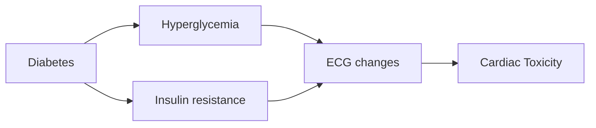

This project was started during the TL1 award and continued during [T32-and-F32-research-years](T32-and-F32-research-years.md). 

Collaborators:

- [Amit-J-Shah-MD-MS](Amit-J-Shah-MD-MS.md)

# Analysis Plan

The first table should be just a description of the cohort, of just CARRS1, based on the causal model.
The main outcome are the above ECG characteristics, while the main exposure will be characteristics of diabetes. 

In this simplified model, I hypothesize that chronic hyperglycemia leads to cardiac fibrosis, which in turn leads to the cardiotoxic effects of diabetes.
Diabetic cardiotoxicity would be similar to other fibrotic processes, such as cardiac amyloidosis - albeit we cannot compare diabetes to amyloid so directly or strongly.
The cardiac fibrosis pattern seems to be diffuse repolarization abnormalities, such as widening of the QRS-T angle, and the decreasing in overall voltage. 
The preliminary work from 2020 fits this pattern.

1. The first step would be to have a simple cohort description between diabetics and non-diabetics.
1. Show the relationship between diabetes status and ECG markers directly, regardless of medication or glycemic control.
1. Then, evaluate the concept of insulin resistance versus chronic hyperglycemia, using A1c and HOMA as comparative models.
    1. Can evaluate the interaction between A1c and HOMA as well.
1. Treatment effect is important. Understanding if the observed ECG changes are mediated by drug therapy is important. Mediation analysis with drug therapy.
1. Test interaction by drug effect if present
1. Prove linearity with spline analysis and ECG changes
