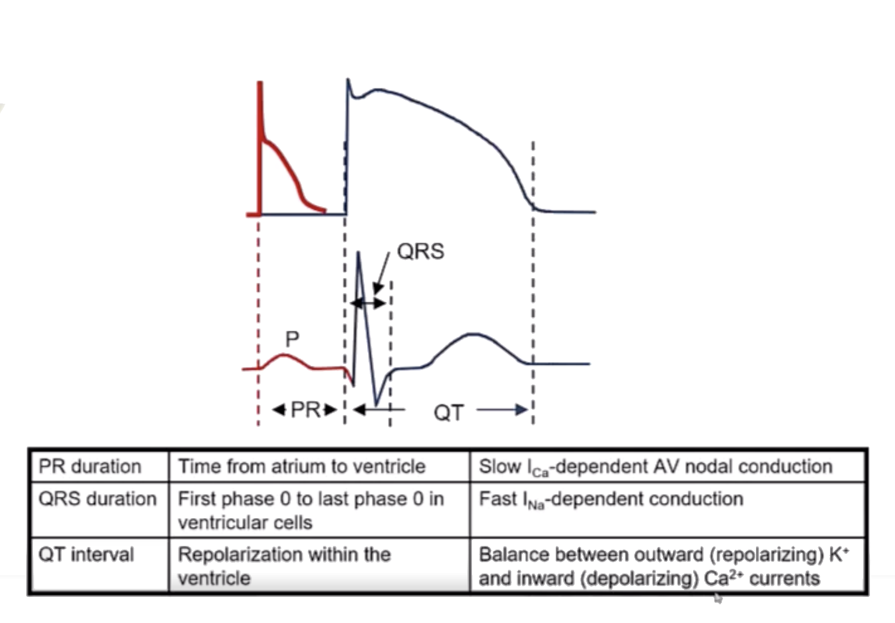
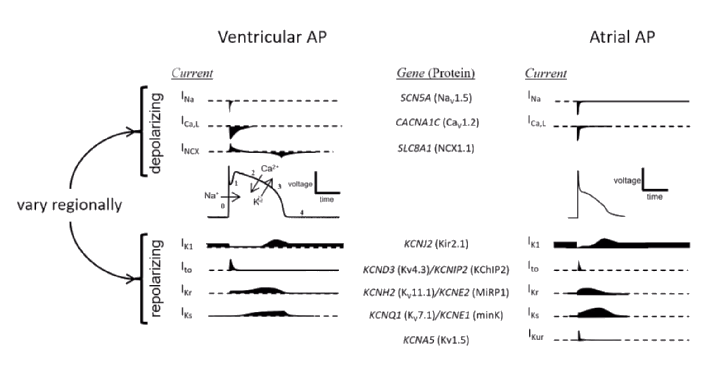
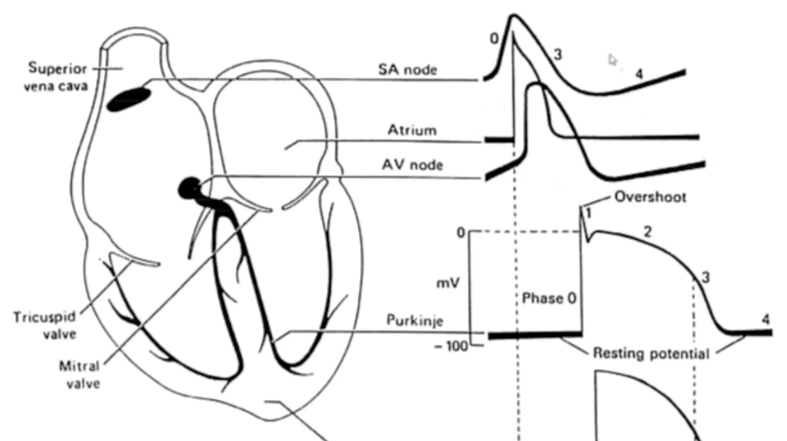
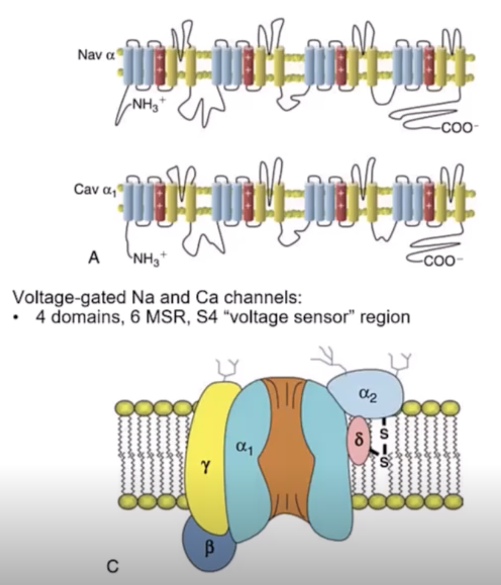
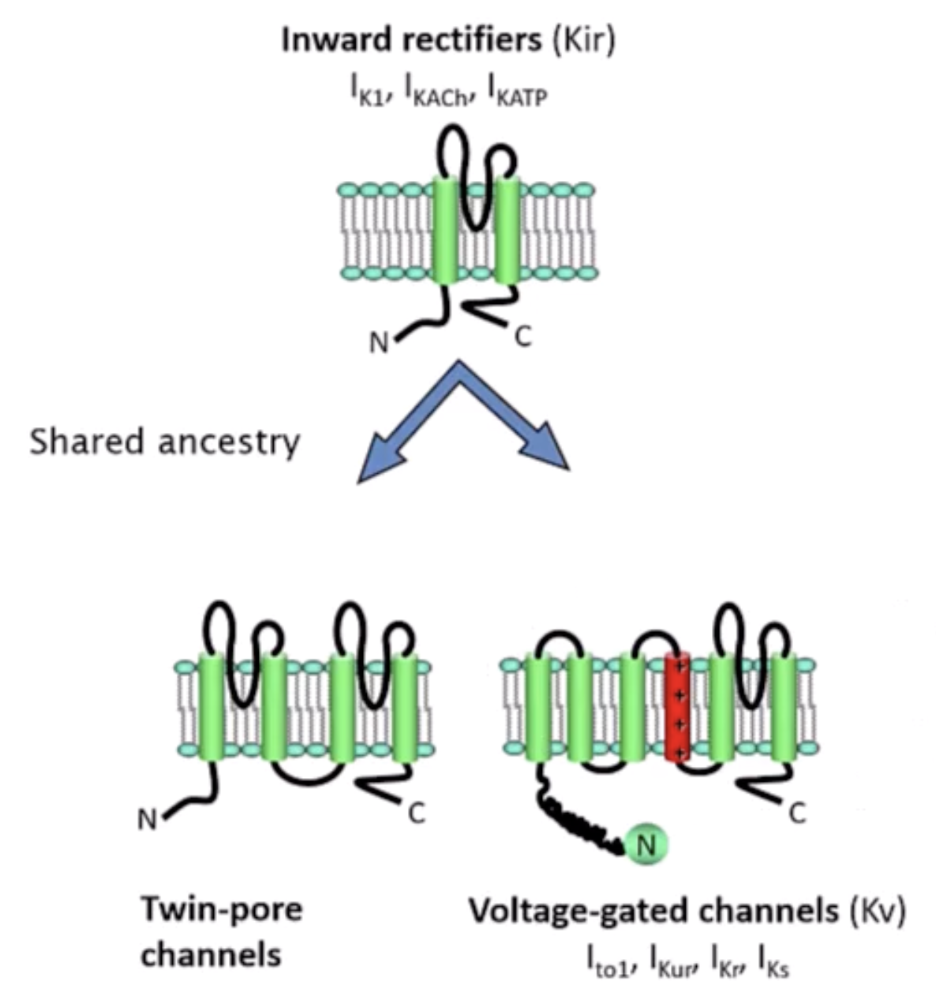
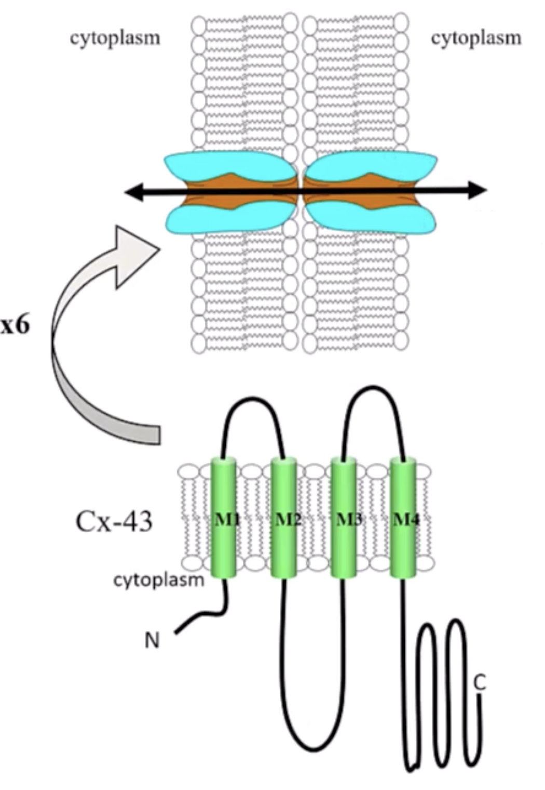
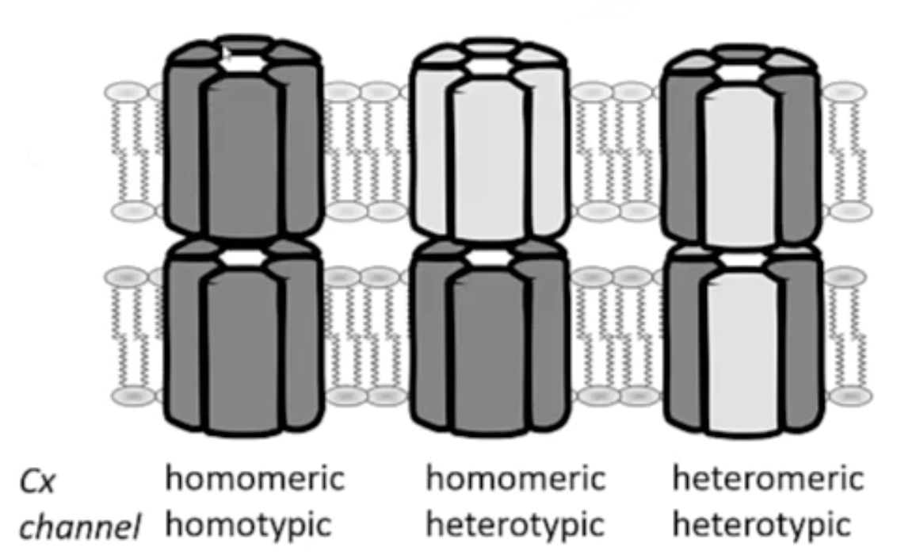

# Glossary

Stimulus for opening and closing channels
- voltage-gated, the majority of channels, primaril.y $Ca^{++}$, $K^+$, $Na^+$
- ligand-gated, such as ACh or ATP 

Biophysical features

- permeation - selectivity and electrochemical gradient (when balanced, its called the zero-current or reversal potential)
- gating - opening and closing
- rectifier - preferential direction of ion transport, mediated by gating or permeation
- $I = N \times P_{open} \times i$, where $I$ is the current magnitude, $N$ is the number of channels, $P_{open}$ is probability of opening, and $i$ is the current of a single channel

# Action potentials

The features inscribed by the underlying myocytes. 

- The PR interval for example is dependent on the slow $I_{Ca}$-dependent AV nodal cells
- QRS is the inscription of the fast $I_{Na}$ that compose phase 0
- QT interval is the balance and plateau of the outward $I_{K+}$ repolarization with inward 

The automatic pacers including the SA node and AV node have different properties.
SA node phase 0 is primarily driven by $Ca^{++}$ and has more rapid diastolic depolarization.
AV node instead has sharper phase 0 but slower diastolic depolarization, thus making it a subsidiary or secondary pacemaker in the heart.

# Channels

## Voltage-gated channels

$Na^+$ and $Ca^{++}$ are common voltage-gated ion channels with a similar structure. 
Composed of 4 homologous domains with 6 membrane-spanning regions. 
Main core is the $\alpha$ subunit that folds into a holochannel for ions, and is modified by the other $\beta$ and $\gamma$ subunits.

In contrast, $K^+$ channels are actually much smaller, 1/4 the size of the $Na^+$ channels.
They tetramerize to form the channel itself.
$K^+$ channels are also very diverse, but have the same parent or ancestor $\rightarrow$ a two membrane-spanning repeat inward rectifying channels. 
Subsequently form voltage-gated and twin-pore channels and other varieties.

## Gap junction channels

Gap junction channels are another type that allow for the heart to have a network pattern of activation.
Main type are connexins, which are 4-domain proteins that hexamerize to form a hemi-pore, which in turn will find a hemi-pore in another membrane to form the full connexon. 

In turn, the components of each connexin can vary, leading to different combinations of connexons.

- homomeric/homotypic = when the subunits in each connexins are the same, and both connexins are the same type
- homomeric/heterotypic = when the subunit in each connexin are the same, but each connexin is of a different type
- heteromeric/heterotypic = when the subunits in each connexin are different, and each connexin is of a different typeªº

# Membrane potential

At rest, the inside of a cell is approximately $-90\ mV$, and $0\ mV$ on the extracellular side.
The extracellular concentration of ions are typical of what is seen on a metabolic panel

- $[Na^+] = 140\ mM$
- $[K^+] = 4\ mM$

On the intracellular side the concentration is 

- $[Na^+] = 10\ mM$
- $[K^+] = 140\ mM$

That is driven by the original Nernst equation.
 
 $$
 E_{m} = \frac{RT}{zF} \times log_{10}(\frac{[C]_{o}}{[C]_{i}})
 $$
   
$E_m$ = resting membrane potential  
$R$ = gas constant ~ 8.3 J/K  
$T$ = temperature (Kelvin)  
$F$ = Faraday's constant = $9.65 \times 10^4 C/mol$

For potassium, which calculates out to be around $-90\ mV$, that looks like...

$$
E_{K^+} = 61.5 log_{10} \frac{[K^+]_{out}}{[K^+]_{in}}
$$

At rest, the primary $Na^+$ channel is closed, thus there both a concentration and electrical gradient from outwards to inwards that is maintained.
Simultaneously, at rest, there is a $K^+$ channel that is an inward rectifier that is open at rest, which allows some $K^+$ to be driven inwards down the electrical gradient preferentially over the concentration gradient. 

In the setting of hyperkalemia, the resting membrane potential can be depolarized, which in turn would lead to opening of sodium channels and sodium influx. 
If $[K^+]_{out} = 10\ mM$, then by the Nernst equation then $E_{K^+} = -67 mV$.

More details on how these are measured are in [patch-clamping](permanent/patch-clamping.md)

# Currents

## Potassium

There are three major delayed rectifiers in the heart. 

|Current|Description|
|-|---|
|$I_{K_s}$| KvLQRT1, from *KCNQ1* and *KCNE1*, LQTS, increases with adrenergic stim|
|$I_{K_r}$| HERG from *KCNH2*, common cause of LQT2, most Tdp-associated drugs block here |
|$I_{K_ur}$| Kv1.5 from *KCNA5*, only detected in atria|

## Calcium

Concentration of $Ca^{++}$ is primarily highest in the extracellular space and in the sarcoplasmic reticulum.
Currents are generally inward rectifiers that bring $Ca^{++}$ into the cytosol, which then has to be shifted back afterwards prior to next contraction.
When the inward $I_{Ca}$ current occurs, it also activates release from the sarcoplasmic reticulum through ryanodine receptors.

The two general mechanisms is back into the extracellular space through $Na^+/Ca^{++}$ exchangers, as well as back into the sarcoplasmic reticulum. 

In structural heart disease, remodeling occurs such that the primary method for $Ca^{++}$ handling is through efflux into the extracellular space (over that of the sarcoplasmic reticulum.
Results in a loss of the __positive force-frequency relationship__, which means that increased frequency of contractions do not lead to similar augmentation of contractions.