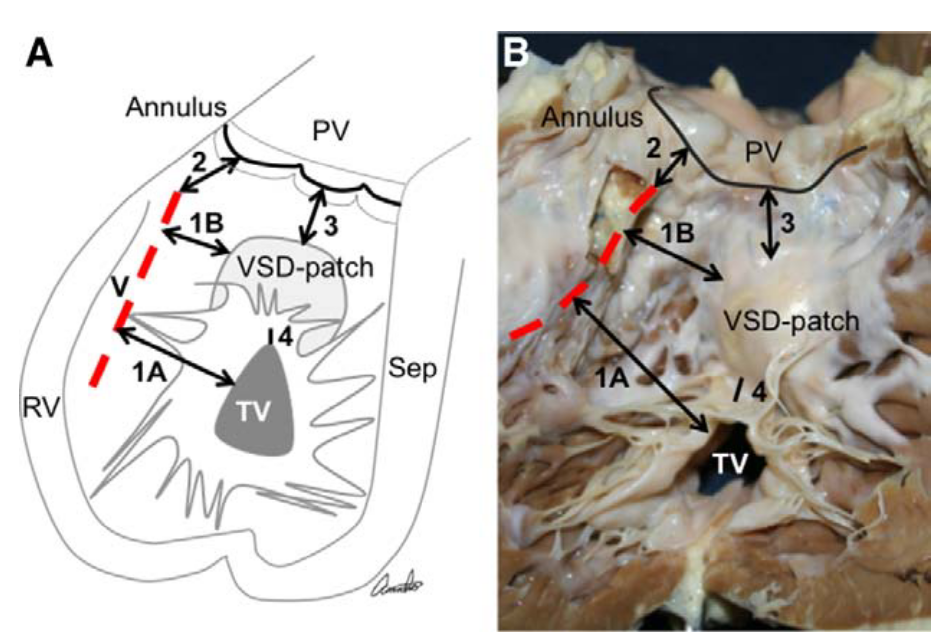

Critical isthmuses seem to be common in VT, with some being generlizable between patients, leading to importance in undedrstanding the relevant anatomy and physiology.

@Moore2013 shows the RV isthmuses seen in ventricular tachycardia in tetralogy of Fallot repairs.

