Sources for this come from...
- [Lecture](https://youtu.be/MBj1Rx8zy2g?si=Y8mVmQ_DKCUTOR2c) from Warren "Sonny" Jackman

# Physics

The components of a bipolar waveform include both near-field and far-field components.
 
The initial component is the far-field ventricular signal (just after the V-stimulation artifcation). The sharp terminal signal is the atrial signal and is underneath the bipole.  _Waveform amplitude reflects the amount of tissue, not its proximity to the recording bipole._

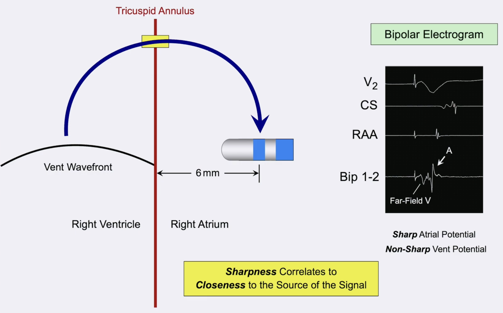

The proximity of hte electrodes effects the recording range. 

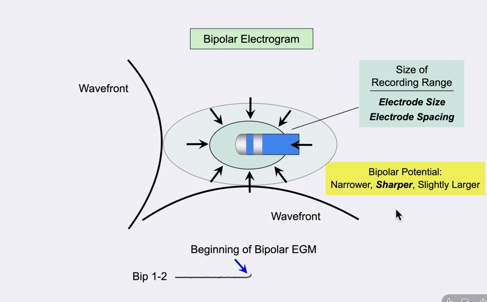

The top recording is wider spacing, while the bottom recording is the most narrow spacing, which is why we have decreased far-field signal and higher resolution, sharper near-field signal.

Unipolar signal translation to bipolar signal is mathematical subtraction of the proximal (positive) and distal (negative) bipoles.

$$
EGM_{bipolar} = EGM_{unipolar_{distal}} - EGM_{unipolar_{proximal}}
$$

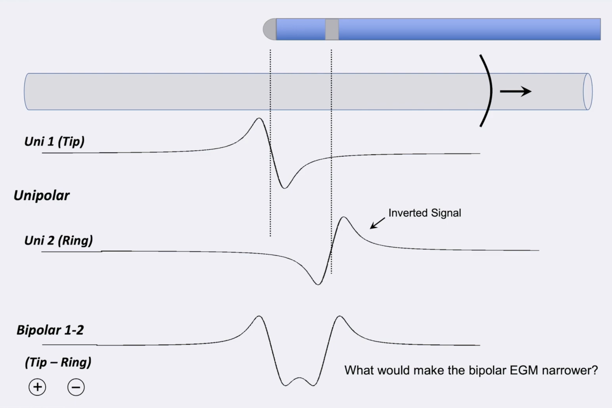

The same math applied can help understand directionality. If the wavefront is coming (assumed in parallel) towards the distal and then proximal bipoles, an rSr' pattern is formed. 
If that is reversed along the same axis, a qRs pattern is seen.
And then, if hte bipole is perpendicular to the wavefront than the proximal electrode serves as a reference electrode and makes a *pseudo-unipolar* EGM, otherwise called a *close unipolar*, which even can be used for timing as it elminates the baseline current noise.

# Noise

Noise on both unipolar and bipolar leads are from different reasons and are managed differently. 
For *bipolar* EGMs, the noise that is present on signal from both the proximal and distal electrodes, and travel through the same cable. 
That noise can be removed through __common mode negation__, which is why bipolar leads are always relatively clean and don't need to be concerned about notch filtering for the electrical frequency. 

However the noise issue is a bigger deal on *unipolar* EGMs. The proximal electrode for the unipolar signal is often the __Wilson Central Terminus__, defined as the average of the three limb electrodes (left, right, foot). 
This is routed back to the differential amplifier by two different cables, 1) from WCT, and 2) from recording catheter. 
That means we cannot use common mode negation, and that the cables physically traverse the room in different areas, which means they can pick up multiple artifacts from the EM noise from other systems. 

The solution is to use a reference electrode in the body, allowing for there to be a common mode rejection to be applied. 
The reason that notch filtering cannot be used is that it also introduces its own artifacts which can mask real findings. 

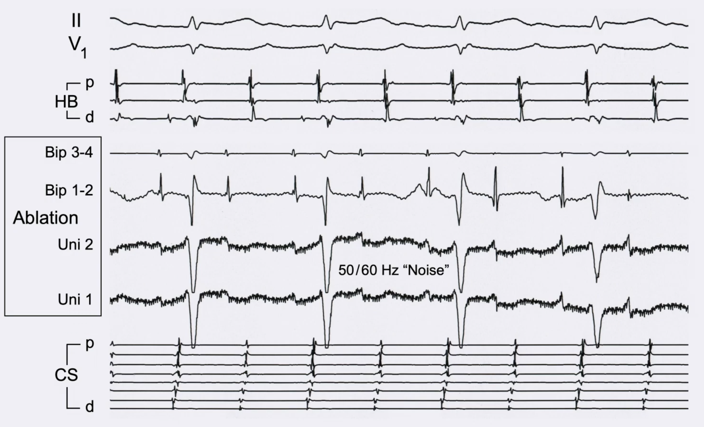

When we apply a notch filter, we can introduce new signals that are confounding our actual signal.

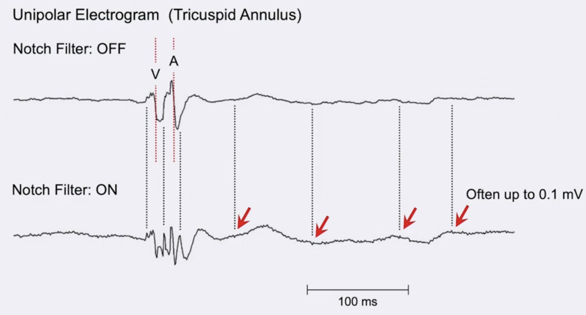

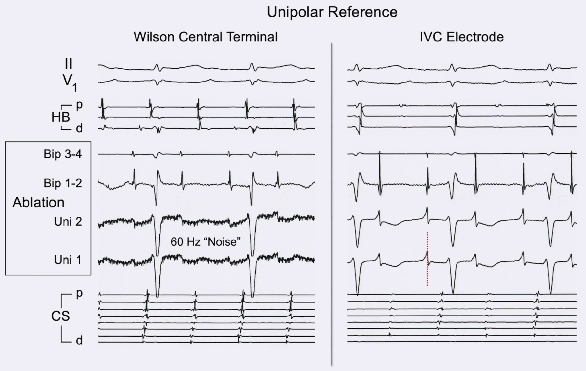

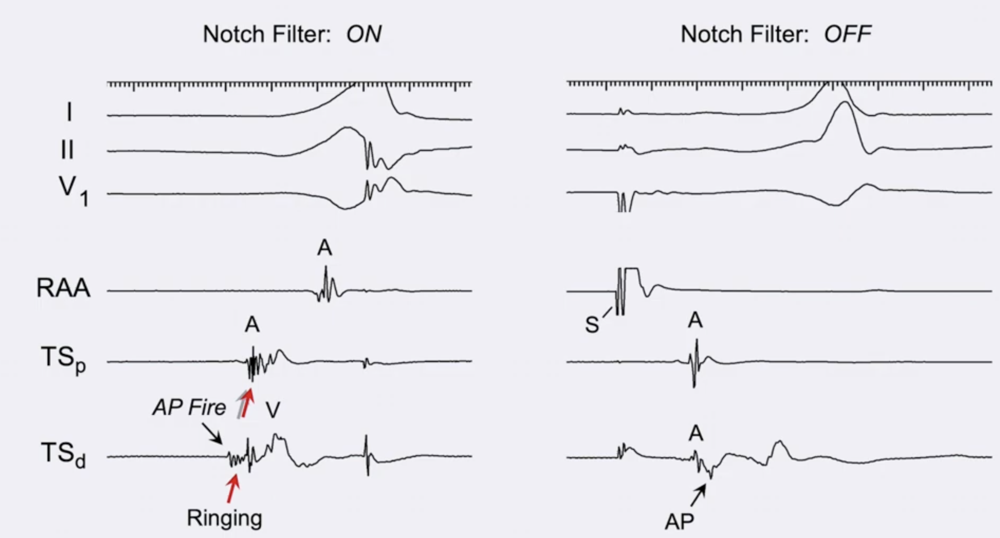

# Filtering

Filters can be applied that help with visualizing waveforms.
Generally we are talking about the bandpass filter. 
The high pass filter allows only frequencies above the set level to pass through, while decreasing the energy of the excluding frequencies; inversely the low pass filter only allows energy below its level to be passed through. 

Generally a default range is 30 - 500 Hz for the bandpass.
The human body doesn't create frequencies generally over 150 Hz, thus the low-pass filter is usually set from 240 to 500 Hz.

The high pass filter however has a huge impact on the waveform. 
On the unipolar, we want the most resolution, thus we want to minimize how much data is filtered out to maximize chances of seeing important EGM signal.
If set to 0.5 Hz, for example, then we will not exclude breathing and thus will have giant sinusoidal changes in the signal (all over the screen $\leftarrow baseline\ drift$. 
If >1 Hz, we can remove the baseline drift, while minimizing unnecessary information.
However on bipolar EGMs, we want to remove farfield signal, so want a higher bar of usually 30 Hz. 

# Annotation

If the arrhythmia is a focal AT or VT or PVC, then there is a site of earliest activation. 
The way to choose that site is based on both the unipolar and bipolar configurations.

1.  Near-field activation is as early as the earliest far-field activation seen on any EGM
1. Distal bipolar recording and unipolar recording begin simultaneously, *which indicates no earlier far-field activation*
1. Morphology of distal unipolar is `Qs` pattern

The arrhythmia seen below in two pictures is a crista terminalis AT that is focal, coming from the superior part of teh crista. The catheters include a decapolar diagnostic catheter and the ablation catheter, identifying the potential ablation site.
The findings support the three-step methodology supported by Jackman.

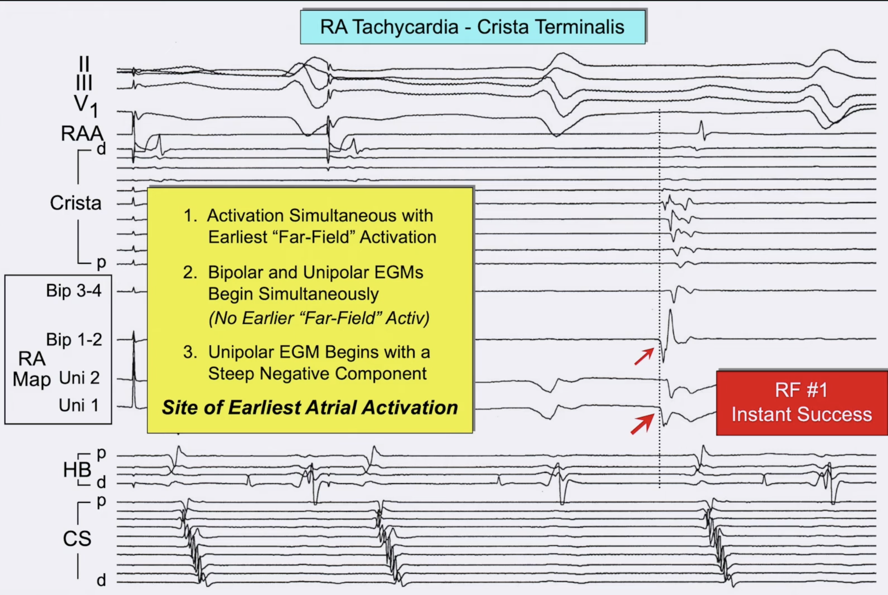

An important concept comes up with pre-potentials.
Not often seen, but when seen, they may be dramatically earlier than other annotated points.
Pre-potentials usually represent some type of local path or channel that can act in an automatic fashion, and are often only visible when just right on top.
Thus, better to ablate pre-potentials after making small movements around in that area. 

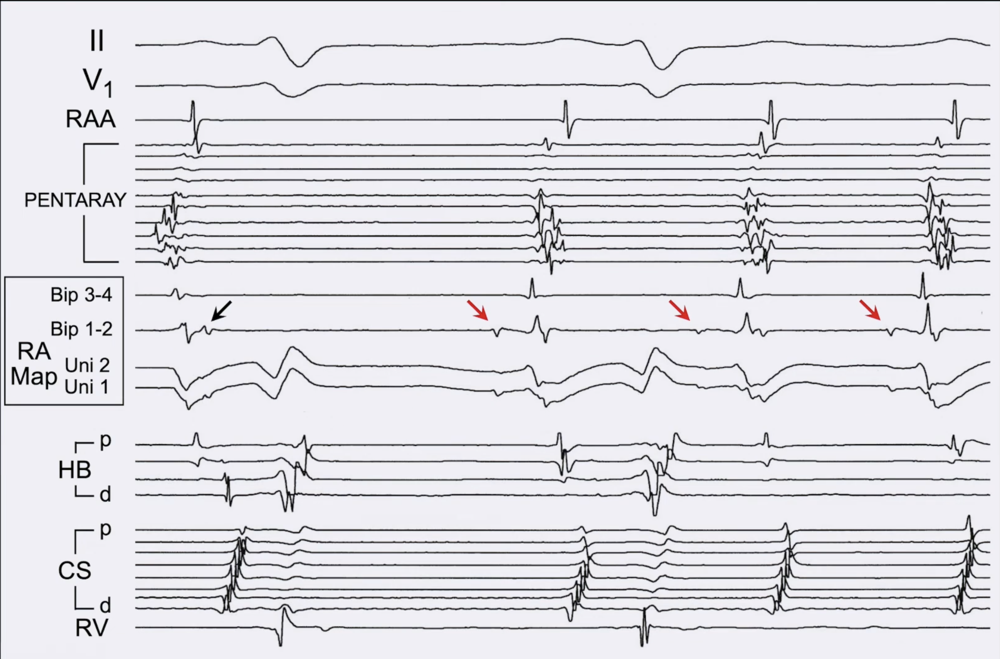

Another issue is thinking about where pre-potentials lie in relationship between the proximal and distal electrodes, and how the unipolar signals can help differentiate that.

Sometimes though in repeat ablations, tissue is very scarred and complex, leading to fractionated EGMs, making annotation difficult.
The findings likely represent a line of block from prior ablation, or a region of slow conduction - more likely block though due to isoelectric components.
The $\frac{dV}{dt}$ method will fail here in terms of potential annotation sites, since it will probably aim for the region in the middle with the sharpest `Qs` pattern, however that has no bipolar findings of near field data.
__Where should we annotate this EGM?__

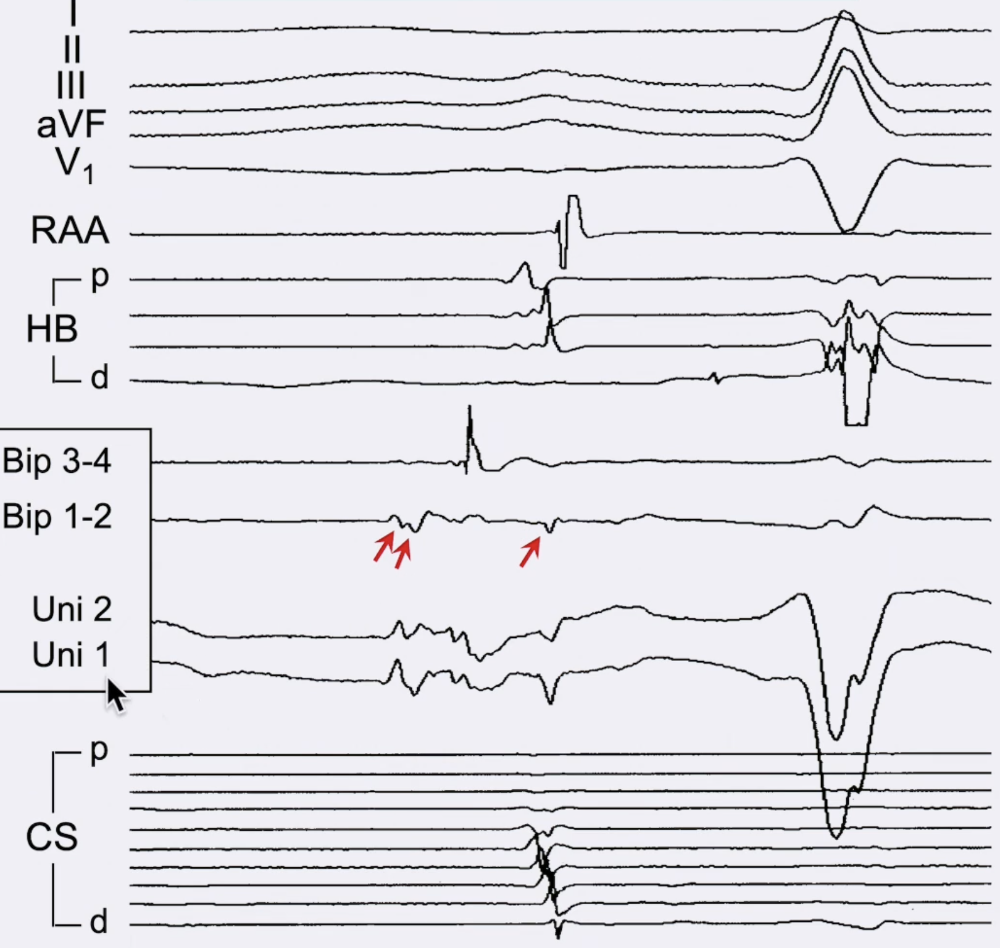

The steps to handling fractionated EGMs requires some *rule-out* of the potential locations by combining information from both unipolar and bipolar recordings.

1. Use the sharp near-field data on the bipolar EGM to identify where to look for supporting clues in the unipolar EGM
1. Rule out locations that have flat or minimal change
1. Identify sites sites that with the sharp $\frac{dV}{dt}$ as the correct location for annotation

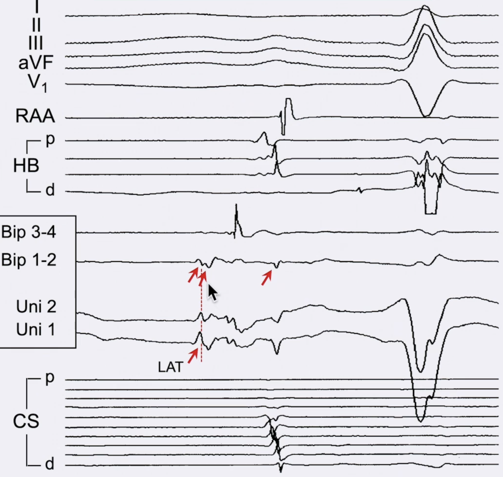
