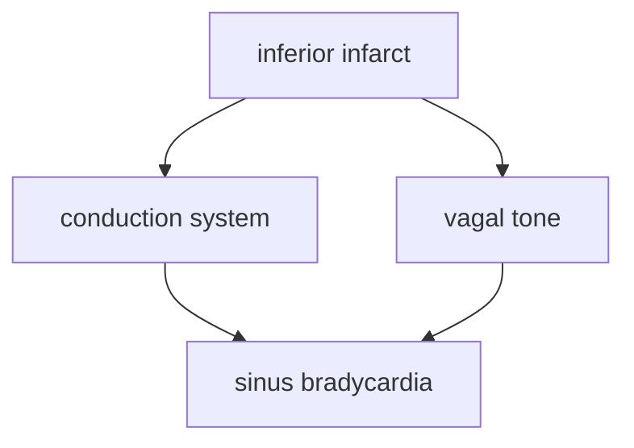

Bradycardia may be from both vagal tone and ischemia of the conduction system. 

# Topography

Vagal tone may impact the topography of the heart by changing conduction speeds and dromotropic properties. [[egm-research-ideas]]
