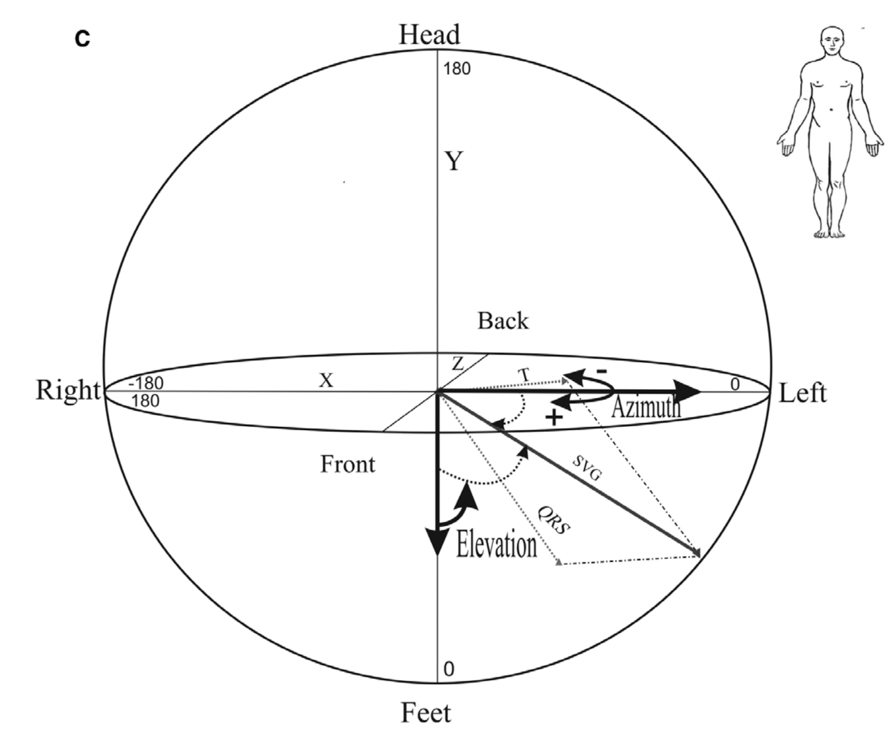

--- 
title: "Thoughts"
author: "Anish Shah"
date: "`r Sys.Date()`"
site: bookdown::bookdown_site
output: bookdown::gitbook
documentclass: book
bibliography: [book.bib, packages.bib, Neurocardiology.bib]
biblio-style: apalike
link-citations: yes
colorlinks: yes
graphics: yes
lot: yes
lof: yes
fontsize: 11pt
mainfont: Palatino
monofont: "Source Code Pro"
monofontoptions: "Scale=0.8"
github-repo: "asshah4/thoughts"
description: "A workspace for thoughts."
---

# Preface {-}

This initially was designed to help document exploratory concepts that were developed using the [card](https://asshah4.github.io/card) package, but also expanded to clinical concepts leveraging the power of R and Rmarkdown.

As this develops, it will likely create its own order. Currently it revolves around the principal components:

- circadian rhythm
- electrocardiography
- autonomic physiology
- clinical medicine
- programming

<!--chapter:end:index.Rmd-->

# Introduction {#intro}

An introduction would go here.

## `R` and RStudio

I have been learning R since 2010, and have found it to be an excellent:

- open-source
- excellent community
- an outstanding IDE with [RStudio](https://rstudio.com/)
- package development

Currently using `r R.version$version.string`, nicknamed `r R.version$nickname`, with RStudio `1.3`.

## `git` and Github

<!--chapter:end:intro.Rmd-->

# Technical Setup {#setup}

A workflow outside of research and medicine should be a natural corollary to it, taking similar approaches to problems to help making things simpler (instead of more complicated). Certain programs, approaches, and [philosophies](https://suckless.org/philosophy/) have made this possible, detailed below.

- vim - text editor
- mutt - email client
- git

## Vim

[Vim](https://www.vim.org/) is much more than a text editor. 

## Mutt

Email clients are typically bloated with additional "features" that are supposed to improve the email experience. However, it seems that these additions in a GUI interface actually slow things down. 

[Mutt](http://www.mutt.org/), and its heavily-featured fork [Neomutt](https://neomutt.org/about.html), are ways around those problems with a command line interface. 

Email is not just a single service, but a bundling of several components. 

- `mutt` is a MUA (mail user agent) that is a front-end for users to manage stored messages in a mailbox
- `msmtp` is a MTA (mail transport agent) that sends mails through SMTP (simple mail transfer protocol)
- `mbsync` is a MRA (mail retrieval agent) that can hop onto a mail server and actually retrieve items from inboxes

Originally, for my personal gmail and professional/institution, the following resources were helpful.

- https://wincent.com/blog/email
- http://stevelosh.com/blog/2012/10/the-homely-mutt/
- https://gitlab.com/muttmua/mutt/wikis/MuttGuide
- https://www.youtube.com/watch?v=2jMInHnpNfQ&t=111s
- https://webgefrickel.de/blog/a-modern-mutt-setup
- https://webgefrickel.de/blog/a-modern-mutt-setup-part-two

## Building a CV

Instead of storing the elements of a CV in a WYSIWYG format, an alternative approach is to use separate files that can be compiled together to produce a CV in a data-driven pipeline. This process was inspired by the [`datadrivencv`](http://nickstrayer.me/datadrivencv/index.html) and [`vitae`](https://pkg.mitchelloharawild.com/vitae/index.html) packages.

Reference links:

- https://slides.mitchelloharawild.com/vitae/#1
- https://github.com/ropensci/rorcid
- https://github.com/robjhyndman/CV

<!--chapter:end:technical.Rmd-->

# (PART) Autonomic Regulation {-}

<!--chapter:end:PART-autonomic.Rmd-->

# Circadian Physiology {#circadian}

## Chronobiology

Will discuss circadian biology/physiology.

## Circadian Disruption

## References

<!--chapter:end:circadian.Rmd-->

# (PART) Computational {-}

<!--chapter:end:PART-computational.Rmd-->

# Cosinor Analysis {#cosinor}

The issue with time series analysis is that the data is by its nature _circular_ and thus cannot be easily be analyzed through traditional, linear methods. The following is the development/expansion of the cosinor model to help study circadian rhythms (\@ref(circadian)) using `R`. 

The `card` package was developed to help tackle this problem. 

```{r}
# Library
library(card)
library(tidyverse)

# Dataset
data("twins")

# Example of data
ggplot(twins, aes(x = hour, y = rDYX)) +
	geom_smooth(method = "gam", se = TRUE) 
```

## Overview

Using the `cosinor()` function, the characteristics of the circadian pattern can be retrieved.

```{r}
# Cosinor model
m <- cosinor(rDYX ~ hour, twins, tau = 24)
summary(m)
```

The statistical principles behind this method allow for different methods to model, diagnose, and interpret findings. [@Refinetti2007; @Cornelissen2014]

- single component cosinor
- multiple component cosinor
- population cosinor
- confidence intervals (ellipse method)
- zero amplitude test
- lack-of-fit testing

The example here use the dataset `twins` which contains a continuous ECG signal, called `DYX`, collected at hourly time points.

## Single component cosinor

The single component cosinor method is modeled as:

$$Y(t) = M + A cos(\frac{2 \pi t}{\tau} + \phi) + \epsilon$$

Where:

$$
\begin{aligned}
M &= MESOR\ (midline\ estimating\ statistic\ of\ rhythm) \\
t &= time in hours \\
\epsilon &= error \\
\phi &= acrophase \\
\tau &= tau\ (period) \\
\end{aligned}
$$

To model this function, it must be transformed linearly to assess the coefficients.

$$Y(t) = M + \beta x_{t} + \gamma z_{t} + \epsilon_{t}$$

The new coefficients and parameters are defined as: 

$$
\begin{aligned}
\beta &= A cos(\phi) \\
\gamma &= -A sin(\phi) \\
x_{t} &= cos(\frac{2 \pi t}{\tau}) \\
z_{t} &= sin(\frac{2 \pi t}{\tau}) \\
\end{aligned}
$$

In the `twins` data, the time value $t$ is measured in hours. As this is 24-hour data, the assumption is that $\tau = 24$. 

```{r}
df <- subset(twins, patid == 60) # Single individual cosinor
y <- df$rDYX
t <- df$hour
n <- length(t) # Number of observations
period <- 24

# Transformed variables
x <- cos(( 2 * pi * t) / period)
z <- sin(( 2 * pi * t) / period)
```

To generate the coefficients in `R` requires sovling a matrix of normal/linear equations. 

```{r}
# Matrices
ymat <- as.matrix(cbind(y = c(sum(y), sum(y * x), sum(y * z))))
mcol <- c(n, sum(x), sum(z)) # Mesor column
bcol <- c(sum(x), sum(x^2), sum(x * z)) # Beta column
gcol <- c(sum(z), sum(x * z), sum(z^2)) # Gamma column
xmat <- as.matrix(cbind(m = mcol, b = bcol, g = gcol))

# Solution
coefs <- solve(t(xmat) %*% xmat, tol = 1e-21) %*% (t(xmat) %*% ymat)
mesor <- coefs[1] # mesor
beta <- coefs[2] # beta
gamma <- coefs[3] # gamma
```

For a single cosinor, as in, the analysis of the values from a single individual over 1 period, the values for the _Amplitude_ ($A$) and _Acrophase_ ($\phi$) can be calculated.

$$
\begin{aligned}
A &= \sqrt{(\beta^2 + \gamma^2)}
\phi &= k \pi + g \times arctan(\frac{\gamma}{\beta})
\end{aligned}
$$

Because the values of $\gamma$ and $\beta$ represent trigonemtric values, the position or quadrant of the circle changes the value of $\phi$.

| $\beta$ | $\gamma$ | k | g |
| --- | --- | --- | --- |
| + | + | 0 | -1 |
| + | - | $-2 \pi$ | +1 |
| - | + | $- \pi$ | +1 |
| - | - | $- \pi$$ | -1 |

These calculations were made with the cosinor model seen above. 

```{r}
# Amplitude
amp <- sqrt(beta^2 + gamma^2)

# Acrophase (phi) must be in correct quadrant
sb <- sign(beta)
sg <- sign(gamma)
theta <- atan(abs(gamma / beta))

if ((sb == 1 | sb == 0) & sg == 1) {
  phi <- -theta
} else if (sb == -1 & (sg == 1 | sg == 0)) {
  phi <- theta - pi
} else if ((sb == -1 | sb == 0) & sg == -1) {
  phi <- -theta - pi
} else if (sb == 1 & (sg == -1 | sg == 0)) {
  phi <- theta - (2 * pi)
}

cat(paste0("Amplitude = ", round(amp, 3)))
cat(paste0("Acrophase = ", round(phi, 3)))
```

## Population-mean cosinor

Based on the work by Cornelissen et al 2014 [@Cornelissen2014], the population mean cosinor can be estimated by applying the single or multiple component cosinor to each individual. 

$$\{\hat{u} = \hat{M}_{i} + \hat\beta_{i} + \hat\gamma_{i} + ... \}$$

Where $i = 1, 2, ..., k$ for each individual contribution to the population cosinor metrics.

Each parameter can then be "averaged" to estimate the population parameters. This allows extension from a single individual to populations, particularly research studies with cohorts of patients. 

The $A$ and $\phi$ however are calculated using the previous equations but through the $\mu_{\beta}$ and $\mu_{\gamma}$ values. The _MESOR_ can be calculated simply by measure the mean value from each sample ($MESOR_{population} = MESOR_{1} + ... + MESOR_{k}$).

```{r}
# Parameters for population mean cosinor, using best datasets
df <- twins %>%
	filter(med_beta_blockers != 1) %>%
	select(c("rDYX", "hour", "patid"))
names(df) <- c("y", "t", "pop")
highCounts <- df %>%
	group_by(pop) %>%
	tally() %>%
	filter(n > 20)

# Subset for full data
df <- subset(df, pop %in% highCounts$pop)

# Number of individuals
k <- length(unique(df$pop))

# Individual cosinor models are implemented for each individual
kCosinors <- 
	with(
		df,
		by(df, pop, function(x) {
			cosinor(y ~ t, data = x, tau = 24)
		})
	)

# The coefficients have to be extracted and summarized
tbl <- sapply(kCosinors, stats::coef)
coef_names <- c("mesor", "amp", "phi", "beta", "gamma")
rownames(tbl) <- coef_names
xmat <- t(tbl)

# Get mean for each parameter (mesor, beta, gamma), ignoring averaged amp/phi
coefs <- apply(xmat, MARGIN = 2, function(x) {
  sum(x) / k
})

mesor <- unname(coefs["mesor"])
beta <- unname(coefs["beta"])
gamma <- unname(coefs["gamma"])

# Get amplitude
amp <- sqrt(beta^2 + gamma^2)

# Acrophase (phi) must be in correct quadrant
sb <- sign(beta)
sg <- sign(gamma)
theta <- atan(abs(gamma / beta))

if ((sb == 1 | sb == 0) & sg == 1) {
  phi <- -theta
} else if (sb == -1 & (sg == 1 | sg == 0)) {
  phi <- theta - pi
} else if ((sb == -1 | sb == 0) & sg == -1) {
  phi <- -theta - pi
} else if (sb == 1 & (sg == -1 | sg == 0)) {
  phi <- theta - (2 * pi)
}

# Update coefficients
coefs["amp"] <- amp
coefs["phi"] <- phi

# Updated coefficients
names(coefs) <- coef_names
print(coefs)
```

### Confidence Intervals for Population Cosinor

The confidence intervals for a population are more complicated to generate, and several approaches are documented in the literature.

#### Ellipsoid Approach

The values, including standard deviation and standard error for the _MESOR_ are calculated using standard statistics along a t-distribution, with degree of freedom based on number of observations. In this case, $\alpha = 0.05$.

```{r}
# Standard error for mesor
kcoefs <- data.frame(xmat)
se <- sd(kcoefs$mesor) / sqrt(k - 1)
cat(round(se, 3))
```

The statistical parameters around the $A$ and $\phi$ are more complex, as they are joined together, and represent a joint confidence region of the substitute parameters $\beta$ and $\gamma$. 

The first step is the calculation of the variance and covariance of $\beta$ and $\gamma$. This can be used to generated teh standard deviation of these variables.

$$
\begin{aligned}
\sigma_{\beta \gamma} &= \sqrt{COV_{\beta \gamma}} \\
\sigma_{\beta} &= \sqrt{VAR_{\beta}} \\
\sigma_{\gamma} &= \sqrt{VAR_{\gamma}} \\
\end{aligned}
$$

```{r}
sbg <- sqrt(cov(kcoefs$beta, kcoefs$gamma))
sb <- sqrt(var(kcoefs$beta))
sg <- sqrt(var(kcoefs$gamma))
```

The next step is the creation of a confidence ellipse for a given confidence interval. This ellipse is defined by all points $(\beta*, \gamma*)$ that satisfy the elliptical equation.

$$
\frac{(\beta - \beta*)^2}{\sigma^2_{\beta}} -
\frac{2r(\beta - \beta*)(\gamma - \gamma*)}{\sigma_{\beta} \sigma_{\gamma}} +
\frac{(\gamma - \gamma*)}{\sigma^2_{\gamma}} = 
\frac{2(1 - r^2)(k - 1)F_{1 - \alpha}}{k(k - 2)}
$$

This can be reorganized/reorderd by solving for a single parameter first, such as $\beta*$, which will lead to two potential values.

$$
\beta* = 
\frac{
	\beta \sigma_{\gamma} - r \sigma_{beta} \gamma + r \sigma_{beta} \gamma* \pm
	\sqrt{(r^2 - 1)[(\gamma* - \gamma)^2 - \frac{2(k-1)}{k(k-2)}F_{1-\alpha}\sigma^2_{\gamma}]}
}
{\sigma_{\gamma}}
$$

... where $r = \frac{\sigma_{\beta \gamma}}{\sigma_{\beta} \sigma_{\gamma}}$

This is calculated using the above equation for a potential sequence of values of $\beta*$ and $\gamma*$. THe constant values are already known to us, including the $\beta$ and $\gamma$ variables.

```{r}
# Variance/covariance and initial values were found above
# Define new constants
alpha <- 0.05
r <- sbg / (sb * sg)
fstat <- qf(1 - alpha, 2, k - 2)

# Sequence values
gseq <- seq(from = -abs(gamma*3), to = abs(gamma*3), length.out = 100)
bpos <- ((beta * sg) - (r * sb * gamma) + (r * sb * gseq) + (sb * sqrt(as.complex((r^2 - 1) * ((gseq - gamma)^2 - ((2 * (k - 1)) / (k * (k - 2)) * fstat * sg^2)))))) / sg
bneg <- ((beta * sg) - (r * sb * gamma) + (r * sb * gseq) - (sb * sqrt(as.complex((r^2 - 1) * ((gseq - gamma)^2 - ((2 * (k - 1)) / (k * (k - 2)) * fstat * sg^2)))))) / sg

# Restrict to only real numbers (not complex/imaginary)
index <- Im(bpos) == 0 | Im(bpos) == Im(bneg) # values are zero in both are REAL numbers
gseq <- Re(gseq[index])
bpos <- Re(bpos[index])
bneg <- Re(bneg[index])


# Plot out ellipse 
ggplot() + 
	# Original values
	geom_point(aes(x = gamma, y = beta), data = kcoefs, alpha = 0.2) + 
	# Potential ellipse versus hyperbola
	geom_point(aes(x = gseq, y = bpos), col = "red", size = 0.5) + 
	geom_point(aes(x = gseq, y = bneg), col = "blue", size = 0.5) + 
	# Predicted segment
	geom_segment(aes(x = 0, y = 0, xend = -amp*sin(phi), yend = amp*cos(phi)), size = 1.5) + 
	# Axes
	geom_vline(xintercept = 0) + 
	geom_hline(yintercept = 0) +
	xlim(-abs(gamma)*5, abs(gamma)*5) + 
	ylim(-abs(beta)*5, abs(beta)*5)


# Using {car}
border <- car::dataEllipse(cbind(kcoefs$gamma, kcoefs$beta), levels = 0.95) %>%
	as_tibble()

ggplot() +
	geom_point(aes(x = x, y = y), data = border, col = "red") + 
	geom_point(aes(x = gamma, y = beta), data = kcoefs, alpha = 0.5) + 
	geom_vline(xintercept = 0) + 
	geom_hline(yintercept = 0) 
```

#### Sampling Matrix Approach

An approach, according to _Bingham et al 1982_, is to use the sampling matrix, generated from the following formulas and calculated below. The key formulas for the population cosinor confidence intervals are:

$$
\begin{aligned}

MESOR &\pm \frac{t_{1 - \alpha/2} \sigma_{MESOR}}{\sqrt{k}} \\

A &\pm t_{1 - \alpha/2} \sqrt{s_{22}} \\

\phi &+ arctan(\frac{s_{23} t^2_{1 - alpha/2} \pm t_{1 - \alpha/2} \sqrt{s_{33}} \sqrt{A^2 - \frac{(s_{22} s_{33} - s^2_{23})t^2_1{1 - \alpha/2}}{s_{33}}}}{A^2 - s_{22} t^2_{1 - \alpha/2}})

\end{aligned}
$$

Where the matrix variables are shown below:

$$
\begin{aligned}
s_{22} &= \frac{\sigma^2_\beta \beta^2 + 2 \sigma_{\beta \gamma} \beta \gamma + \sigma^2_{\gamma} \gamma^2}{k A^2} \\

s_{23} &= \frac{-(\sigma^2_{\beta} - \sigma^2_{\gamma})(\beta \gamma) + \sigma_{\beta \gamma} (\beta^2 - \gamma^2)}{k A^2} \\

s_{33} &= \frac{\sigma^2_{\beta} - 2 \sigma_{\beta \gamma} \beta \gamma + \sigma^2_{\gamma} \beta^2}{k A^2}
	
\end{aligned}
$$

Thus, we can use these equations to calculate the confidence intervals.

```{r}
# Stats
alpha <- 0.05
tdist <- qt(1 - alpha/2, k - 1)

# Matrix variables
s22 <- ((sb^2 * beta^2) + (2 * sbg * beta * gamma) + (sg^2 * gamma^2)) / (k * amp^2)
s23 <- (-1 * (sb^2 - sg^2) * (beta * gamma) + sbg * (beta^2 - gamma^2)) / (k * amp^2)
s33 <- ((sb^2 * gamma^2) - (2 * sbg * beta * gamma) + (sg^2 * beta^2)) / (k * amp^2)
```

#### Approach by Fernandez [@Fernandez2004]

The population aproach can also be predicted through an alternative, perhaps more intuitive way. If normality is assumed, the estimated parameters can be generated from the individual parameters, similar to the _MESOR_, in a single population, and allows for simple statistical testing between populations. [@Fernandez2004]

```{r}
# Stats
kcoefs <- data.frame(xmat)
alpha <- 0.05
tdist <- qt(1 - alpha/2, k - 1)

# Plot
g <- ggplot() +
	geom_segment(
		aes(
			x = gamma - (tdist * sd(kcoefs$gamma) / sqrt(k)),
			xend = gamma + (tdist * sd(kcoefs$gamma) / sqrt(k)),
			y = 0,
			yend = 0
		),
		col = "cornflowerblue",
		size = 2
	) + 
	geom_segment(
		aes(
			y = beta - (tdist * sd(kcoefs$beta) / sqrt(k)),
			yend = beta + (tdist * sd(kcoefs$beta) / sqrt(k)),
			x = 0,
			xend = 0
		),
		col = "indianred",
		size = 2
	) +
	geom_rect(
		aes(
			ymin = beta - (tdist * sd(kcoefs$beta) / sqrt(k)),
			ymax = beta + (tdist * sd(kcoefs$beta) / sqrt(k)),
			xmin = 0,
			xmax = gamma + (tdist * sd(kcoefs$gamma) / sqrt(k))
		),
		fill = "indianred",
		alpha = 0.5
	) + 
	geom_rect( 
		aes(
			ymin = 0,
			ymax = beta - (tdist * sd(kcoefs$beta) / sqrt(k)),
			xmin = gamma - (tdist * sd(kcoefs$gamma) / sqrt(k)),
			xmax = gamma + (tdist * sd(kcoefs$gamma) / sqrt(k))
		),
		fill = "cornflowerblue",
		alpha = 0.5
	) + 
	geom_point(aes(x = gamma, y = beta), size = 2) + 
	geom_segment(
		aes(
			x = 0, 
			y = 0, 
			xend = -amp*sin(phi), 
			yend = amp*cos(phi)
		), 
		size = 1.2
	) + 
	geom_vline(xintercept = 0) + 
	geom_hline(yintercept = 0) 
	
# Values possible for amplitude
is.logical(round(kcoefs$amp * cos(kcoefs$phi), 3) == round(kcoefs$beta, 3))

# Values for phi
is.logical(round(kcoefs$amp * -1 * sin(kcoefs$phi), 3) == round(kcoefs$gamma, 3))

sd(kcoefs$beta)
sd(kcoefs$gamma)
```

However, this method is more complicated when multiple components are included.

## Multiple-Component Cosinor

Fitting physiological/circadian data may involve other patterns than a single, 24-hour frequency. There may be additional components or cosine waves that better explain the datasets, such as at 8 hours (e.g. meal times). Thus, it can be beneficial to add a secondary component.

Implementing this in `R` is made complex as it now uses a variable number of inputs and variable number of outputs. This is performed through the paradigm suggested in the `hardhat` package, with a user-facing and computational side. The input data is given in the function call, then bridged to the model implementation. 

$$
\begin{aligned}
y(t) &= M + \sum_{j}(A_{j} cos(2 \pi t / \tau_{j} + \phi_{j}) \\
y(t) &= M + \beta_{j} x_{j} + \gamma_{j} z_{j} 
\end{aligned}
$$

Where $j = 1,\ 2,\ ... p$, which is the number of parameters. In a single component cosinor, there are at 3 parameters: $2(p=1) + 1$, and in a multiple component: $2(p=j) + 1$. The components are based on the periods.

In a _formula_ based approach...

```{r}
# This is the final dataset for a single component, however we have multiple
object <- cosinor(rDYX ~ hour, data = twins, tau = c(24, 8))
cat(object$call)

# Periods
tau <- c(24, 8) # Two components
l <- length(tau)
j <- 2*l + 1
period <- tau

# No variable parameters
y <- outcomes <- twins$rDYX
t <- predictors <- twins$hour
n  <- length(t)

# Need to create number of x values to match number of periods
	# x1, x2, z1, z2 in this case
for(i in 1:l) {
  assign(paste0("x", i), cos((2 * pi * t) / period[i]))
  assign(paste0("z", i), sin((2 * pi * t) / period[i]))
}

# Creating a new dataframe with all variables
model <- data.frame(y, t, mget(paste0("x", 1:l)), mget(paste0("z", 1:l)))

# The formula, where the intercept will be the MESOR (not included)
f <- as.formula(
  paste0("y ~ ", paste0("x", 1:l, " + ", "z", 1:l, collapse = " + "))
)
print(f)

# Can create a model frame here using two approaches
# Base R and with hardhat
m <- model.frame(f, model)
xmat <- model.matrix(f, m)
ymat <- as.matrix(y)

# Hardhat
framed <- hardhat::model_frame(f, model)
mat <- hardhat::model_matrix(framed$terms, framed$data)

# Solve for coefficients, including amplitude and acrophase
coefs <- solve(t(xmat) %*% xmat) %*% t(xmat) %*% ymat
mesor <- coefs[1]

for(i in 1:l) {
	
	# Beta and gamma terms
	assign(paste0("beta", i), unname(coefs[paste0("x", i),]))
	assign(paste0("gamma", i), unname(coefs[paste0("z", i),]))
	
	# Amplitude
	assign(paste0("amp", i), sqrt(get(paste0("beta", i))^2 + get(paste0("gamma", i))^2))
	
	# Phi / acrophase
	sb <- sign(get(paste0("beta", i)))
	sg <- sign(get(paste0("gamma", i)))
	theta <- atan(abs(get(paste0("gamma", i)) / get(paste0("beta", i))))
	
  if ((sb == 1 | sb == 0) & sg == 1) {
    phi <- -theta
  } else if (sb == -1 & (sg == 1 | sg == 0)) {
    phi <- theta - pi
  } else if ((sb == -1 | sb == 0) & sg == -1) {
    phi <- -theta - pi
  } else if (sb == 1 & (sg == -1 | sg == 0)) {
    phi <- theta - (2 * pi)
  }
	
	assign(paste0("phi", i), phi)
}

coefs <- unlist(c(mesor = mesor, mget(paste0("amp", 1:l)), mget(paste0("phi", 1:l)), mget(paste0("beta", 1:l)), mget(paste0("gamma", 1:l))))

```

In a multiple-component cosinor analysis, if the periods are harmonic, as in if the longest value of $\tau$ is an integer multiple of the shortest $\tau$ (fundamental frequency), additional features can be extracted from the fit. 

- $A_{g}$ - global amplitude, defined as half of the difference between peak and trough values
- $\phi_{O}$ - orthophase, defined as lag time to peak value
- $\phi_{B}$ - bathyphase, defined as lag time to trough value

This can be assessed through the fitted values in an augmented `cosinor` object.

```{r}
# Multiple component object
object <- cosinor(rDYX ~ hour, data = twins, tau = c(24, 12))

# Retrieve parameter values and fit
aug <- augment(object)
fit <- unique(aug[c("t", ".fitted")])
mesor <- object$coefficients[1]

# Orthophase
peak <- max(fit$.fitted)
orthophase <- fit$t[which.max(fit$.fitted)]

# Bathyphase
trough <- min(fit$.fitted)
bathyphase <- fit$t[which.min(fit$.fitted)]

# Global amplitude
globalAmp <- (peak - trough) / 2

# Reference phase
zero <- min(aug$t)

# Plot
ggplot(fit, aes(x = t, y = .fitted)) +
	stat_smooth(method = "gam", color = "black", se = FALSE, size = 1.2) + 
	# Mesor
	geom_hline(yintercept = mesor, color = "grey") + 
	geom_text(x = zero + 1, y = mesor + 0.01*mesor, label = "MESOR") + 
	# Orthophase
	geom_vline(xintercept = orthophase, color = "grey") + 
	geom_point(aes(x = orthophase, y = peak), size = 2) + 	
	geom_segment(
		aes(x = zero, xend = orthophase, y = peak, yend = peak),
		linetype = "dotted", size = 0.8
	) +
	geom_text(
		aes(x = (orthophase - zero) / 2, y = peak + 0.01*mesor), 
		label = "Orthophase"
	) + 
	# Bathyphase
	geom_vline(xintercept = bathyphase, color = "grey") + 
	geom_point(aes(x = bathyphase, y = trough), size = 2) + 	
	geom_segment(
		aes(x = zero, xend = bathyphase, y = trough, yend = trough),
		linetype = "dotted", size = 0.5
	) + 
	geom_text(
		aes(x = (bathyphase + zero) / 2, y = trough - 0.01*mesor), 
		label = "Bathyphase"
	) + 
	# Global Amplitude
	geom_segment(
		aes(x = orthophase, xend = (orthophase + bathyphase)/2, y = peak, yend = peak),
		linetype = "twodash", size = 0.5
	) + 
	geom_segment(
		aes(x = bathyphase, xend = (orthophase + bathyphase)/2, y = trough, yend = trough),
		linetype = "twodash", size = 0.5
	) + 
	geom_segment(
		aes(
			x = (orthophase + bathyphase)/2, 
			xend = (orthophase + bathyphase)/2,
			y = mesor,
			yend = trough
		),
		linetype = "twodash", size = 0.5, 
		arrow = arrow(type = "closed", length = unit(0.03, "npc"))
	) + 
	geom_segment(
		aes(
			x = (orthophase + bathyphase)/2, 
			xend = (orthophase + bathyphase)/2,
			y = mesor,
			yend = peak
		),
		linetype = "twodash", size = 0.5, 
		arrow = arrow(type = "closed", length = unit(0.03, "npc"))
	) + 
	geom_text(
		aes(x = (bathyphase + orthophase)/2 + 4, y = 1.01*mesor),
		label = "2 x Global Amplitude"
	) + 
	theme_minimal() 
```


<!--chapter:end:cosinor.Rmd-->

# Heart {#heart}

As a physician, the mental model of disease is a human _substrate_ that has been altered or damaged, such as a weakened heart after a myocardial infarction. Its an intuitive concept that is built on experience that stems from the underlying clinical research. That idea of mapping a disease onto a substrate allows for a certain simplicity in explaining a disease - physician's teach via metaphor.

The heart is metaphorically a house. It has rooms that are separated by doors, it has pipes in the walls, and electricity running through it. 

- plumbing: epicardial and resistance vessels
- electric: sinoatrial and atrioventricular nodes and their corresponding fibers
- structure: the size and shape of the chambers, the valves, etc 

If an intuitive model such as this could be studied, would we make advances in cardiovascular medicine and research? Using the object-oriented programming approach with the __S4__ class in `R`, it will be explored.

## Using S4

```{r}
# First S4 method
library(methods)
heart <- setClass(
	"heart",
	slots = c(
		plumbing = "list",
		electric = "list",
		structural = "list"
	)
)

# Make a new object
first <- new(
	"heart", 
	plumbing = list("LHC", "RHC"), 
	electric = list("SA", "AV"), 
	structural = list("LA", "RA", "LV", "RV")
)

# Or, through the generator function
second <- heart(
	plumbing = list("LHC", "RHC"), 
	electric = list("SA", "AV"), 
	structural = list("LA", "RA", "LV", "RV")
)
				 
```


<!--chapter:end:heart.Rmd-->

# Package Development {#package}

[CRAN](https://cran.r-project.org/) supports the publishing of open-source packages in `R`. The workflow on package development is improved by the following supporting packages:

- `devtools`
- `pkgdown`
- `usethis`
- `testthat`
- `roxygen`
- `hardhat` (creating modeling functions)

In addition, __git__ and [Github](https://github.com/) are fundamental for version control in the development process. These resources were used in the development of my first package, [`card`](https://asshah4.github.io/card).

## Documenting a Package

The use of `roxygen` is fundamental in the process of package development, forcing explanatory variables and parameters to be documented as functions are developed.

### Website

The package `pkgdown` helps turn documentation into a visually attractive and navigable website. 

In addition, in the fashion of `R`, package logos are developed with a [hexagon-framed sticker](http://hexb.in/), representing a package. The development of a hex sticker is aided by the use of:

- https://github.com/GuangchuangYu/hexSticker
- http://connect.thinkr.fr/hexmake/

## Building a Modeling Package

With the development of the `card::cosinor()` function, the _tidy_ approach was inspired by the work of Max Kuhn's [`hardhat` package](https://tidymodels.github.io/hardhat/index.html). THe basic concepts are:

- models require a user-facing interface 
- models require an internal, computational interface
- these two interfaces must be bridged

### Blueprints

The idea of bridging the user-interface and the computational interface seems to be the birth of the `hardhat::new_blueprint()` concept, with its derivatives for standard user-facing methods (formulas, recipes, matrices, etc). 


<!--chapter:end:package.Rmd-->

# Functions {#functions}

The current approach philosophically in R is that everything is either a function or an object. A function, essentially a "predicate", is used on any object, essentially a "noun". 

This workflow of `output <- function(input)` builds on the concepts of functional programming, and is a good intellectual/philosophical approach to most problems. 

In `R`, a good function: 

- allows for some level of flexibility in input with stability of output
- allows for back-ends to improve performance/functionality without impacting the function user
- is extensible

## Speed of _for loops_

Here is an issue with a function using _for loops_. Generally, if there is an iterative process internal to the function, it will have an $~O(N^2)$ performance. The `card::recur()` is built with intuitive _for loops_, at a significant cost with increased _N_ sizes.

Here is the performance of the function:

      test replications elapsed relative user.self sys.self user.child sys.child
4		 15000						1 901.169  618.086   882.081   18.467          0         0
3 		5000            1 115.573   79.268   112.617    2.942          0         0
1 		 100	          1   1.458    1.000     1.448    0.009          0         0
2 		1000		        1  15.268   10.472    15.234    0.036          0         0

```{r, echo = FALSE}
print("
      test replications elapsed relative user.self sys.self user.child sys.child
4		 15000						1 901.169  618.086   882.081   18.467          0         0
3 		5000            1 115.573   79.268   112.617    2.942          0         0
1 		 100	          1   1.458    1.000     1.448    0.009          0         0
2 		1000		        1  15.268   10.472    15.234    0.036          0         0
")
```

The function currently relies on _for loops_ througout, as seen below:

```{r}
print(card::recur)
```


<!--chapter:end:functions.Rmd-->

# Modeling {#models}

Here is a collection of explorations on modeling approaches as they related to electrocardiography and epidemiology. This is a _sandbox_ for developing meta-modeling functions as well.

- Multiple models
- Visualizing multiple models
- New functions to build models in certain sequences
- Integration for `parsnip` models

## Modeling Multiple Outcomes and Predictors

A recurrent issue with causality-focused modeling with ECG data is that there are multiple outcomes (different ECG features). For example, in the `card` package, the `geh` dataset contains several ECG features based on [vectorcardiography](#vcg).

```{r}
library(card)
library(tidyverse)
data(geh)
names(geh)
```

The first issue is the causal model, which can be visualized using a directed acyclic graph. The variables of interest are a subset of the dataset. In this case, we're looking at the relationship of diabetes with cardiotoxicity in a very small subset of participants.

```{r}
library(ggdag)

bd <- dagify(
		GEH ~ DM + Age + BMI + HTN + CAD + IR + Sex,
		DM ~ Age + IR + BMI,
		CAD ~ DM + BMI + HTN + Age + Sex,
		HTN ~ Age,
		IR ~ BMI + Age,
		Age ~ Sex,
		exposure = "DM",
		outcome = "GEH"
)

d1 <- ggdag_parents(bd, "DM", layout = "star") + 
	theme_dag() + 
	theme(legend.position = "none") +
	labs(title = "Factors Affecting Diabetes")

d2 <- ggdag_parents(bd, "GEH", layout = "star") + 
	theme_dag() + 
	theme(legend.position = "none") +
	labs(title = "Factors Affecting GEH")

# Combine and plot
gridExtra::grid.arrange(d1, d2, nrow = 1)
```

As we can see, many things effect ECG findings, and a subgroup of those impact diabetes, suggesting a number of potential effect modifiers and potential confounders/mediators. Using a sequential model building method in the `card` package allows for a simple way to perform this analysis. This will build a linear model for each outcome, and repeat the model with an additional covariate in the sequence of listed in the formula.

```{r}
# Select variables
vars <- 
	c("svg_mag", "az_svg", "el_svg", "qrs_tang", "log_auc_qt", "log_wvg", "lab_hba1c", "lab_fasting_bg", "homa", "dm", "age", "bmi", "bmi_cat", "age_cat", "sex", "htn", "cad", "lab_ser_creatinine", "lab_tchol") 
	
test_data <-
	geh |>
	select(all_of(vars)) |>
	#na.omit() |>
	#filter(homa <= 5 * sd(homa, na.rm = TRUE)) |> # Remove outliers
	mutate(
		bmi_cat = 
			factor(bmi_cat, levels = c(0:3), 
						 labels = c("Underweight", "Normal", "Overweight", "Obese")),
		age_cat = 
			factor(age_cat, levels = c(0:2), 
						 labels = c("<45", "45-65", ">65")),
		sex = factor(sex, levels = c(0,1), labels = c("Female", "Male"))
	) |>
	mutate(across(
		c(svg_mag, az_svg, el_svg, qrs_tang, log_auc_qt, log_wvg), 
		function(x) {
			as.vector(scale(x, center = TRUE, scale = TRUE))
		}
	))

# Sequential model building
models <- 
	card::build_models(
		svg_mag + az_svg + el_svg + qrs_tang + log_auc_qt + log_wvg ~ 
			lab_hba1c + age + sex + bmi + cad + htn, 
		data = test_data,
		exposure = "lab_hba1c",
		engine = "linear",
		type = "sequential"
	)

head(models)
```

To assess or get a sense of how the variables are playing out, we can visualize the estimates across the builds of the models. This will also use the `gganimate` package to show the effect of data layering

```{r, message=FALSE}
# Libraries
library(gganimate)
library(ggthemes)

# Data
df <- 
	models |>
	# Remove intercepts
	filter(term != "(Intercept)") |>
	# Sequence the terms
	mutate(
		term = 
			factor(
				term, 
				levels = c("lab_hba1c", "age", "sexMale", "bmi", "cad1", "htn1"),
				labels = c("HbA1c", "Age", "Sex", "BMI", "CAD", "HTN")
			)
	) 

# ggplot
g <- ggplot(df, aes(x = factor(covar), y = estimate, color = term)) + 
	facet_wrap(~outcomes, scales = "fixed") + 
	geom_point(
		aes(color = term), 
		data = filter(df, p.value >= 0.20), 
		shape = 1, 
		position = "jitter"
	) + 
	geom_point(
		aes(color = term), 
		data = filter(df, p.value < 0.20), 
		shape = 19, 
		position = "jitter"
	) + 
	scale_color_ptol(name = "Predictors") + 
	theme_minimal() + 
	theme(
		legend.position = "bottom", legend.box = "horizontal",
		panel.border = element_rect(colour = "black", fill = NA)
	) + 
	labs(
		title = "Estimates in Sequential Models",
		x = "Number of Covariates in Model",
		y = "GEH Parameters (z-normalized)"
	)

# Animated
a <- g + transition_reveal(covar)

animate(a, end_pause = 30)
```

## Building a Modeling Matrix Function

One issue that has occurred is that using the function `build_models()` is the idea that a prespecified formula can be used to generate a large number of models, so we can assess the impact of each variable on the model. However, in R, the limitation is that each regression package is unique in how it is specified. One option is to rely on the prespecified `parsnip` models that unify regression modeling formulas.

### A `tidy` Approach to Multiple Outcomes and Predictors

Here is a base example that I hope to build off of (generated by Julia Silge for an issue filed on the `workflows` package). This goes back to the approach listed in [R4DS](https://r4ds.had.co.nz/many-models.html) that shows the `purrr` method of regressions with the `map()` function.

Here is a base example that I hope to build off of (generated by Julia Silge for an issue filed on the `workflows` package).

```{r, echo = TRUE, eval = FALSE}
library(tidymodels)
library(vctrs)
#> Attaching package: 'vctrs'
#> The following object is masked from 'package:tibble':
#> 
#>     data_frame
#> The following object is masked from 'package:dplyr':
#> 
#>     data_frame

outcome <- "mpg"
predictors <- setdiff(names(mtcars), outcome)

# Specify parsnip model to be used
lm_spec <- linear_reg() |> set_engine("lm")

## make a little function to create a workflow with `mpg` as outcome and our set of predictors
wf_seq <- function(preds) {
  workflow() |>
    add_model(lm_spec) |>
    add_variables(outcomes = mpg, predictors = !!preds)
}

## set up the "sequential" set of predictors and create each workflow, then fit
tibble(num_preds = 1:length(predictors)) |>
  mutate(preds     = map(num_preds, ~vec_slice(predictors, 1:.))) |>
  mutate(wf        = map(preds, wf_seq),
         fitted_wf = map(wf, fit, mtcars))
#> # A tibble: 10 x 4
#>    num_preds preds      wf         fitted_wf    
#>        <int> <list>     <list>     <list>    
#>  1         1 <chr [1]>  <workflow> <workflow>
#>  2         2 <chr [2]>  <workflow> <workflow>
#>  3         3 <chr [3]>  <workflow> <workflow>
#>  4         4 <chr [4]>  <workflow> <workflow>
#>  5         5 <chr [5]>  <workflow> <workflow>
#>  6         6 <chr [6]>  <workflow> <workflow>
#>  7         7 <chr [7]>  <workflow> <workflow>
#>  8         8 <chr [8]>  <workflow> <workflow>
#>  9         9 <chr [9]>  <workflow> <workflow>
#> 10        10 <chr [10]> <workflow> <workflow>
```

This goes back to the approach listed in [R4DS](https://r4ds.had.co.nz/many-models.html) that shows the `purrr` method of regressions with the `map()` function.

A data frame that described this would be likely the most succinct way to handle this issue, using several specified elements:

- a single dataframe that was made, to be used throughout
- column to describe the number of predictors or to help identify each row
- column that contains the predictors
- column that contains the outcomes (allowing for combinations)
- column that specifies the exposures (or fixed effects)
- column that contains model specifications using `parsnip`
- column that contains workflows

To set this up, likely there will need to be several functions/steps:

1. Creating a modeling "matrix" as above
2. Updating or allowing modifications to the table to occur, such as combining additional matrices, etc
3. Fitting the models using the specified workflows

The primary structure here will be a `tibble` that contains the basic parameters that can be extracted at the end. 

### Creating a modeling matrix

Here we can see a slighly modified set of sequences to create a data frame that would hold the workflow needed for a regression analysis, but without the actual results or fit.

```{r}
# Would like to use a formula approach to create this matrix
f <- svg_mag + qrs_tang ~ lab_hba1c + age + sex + bmi + cad + htn 

# Left and right side, and length of each
outcomes <- all.vars(f[[2]])
predictors <- all.vars(f[[3]])
n_outcomes <- length(outcomes)
n_predictors <- length(predictors)

# Assuming this will be a linear regression
lm_mod <- parsnip::linear_reg() |> parsnip::set_engine("lm")

wf_seq <- function(outs, preds, mods) {
  workflows::workflow() |>
    workflows::add_model(mods) |>
    workflows::add_variables(outcomes = !!outs, predictors = !!preds)
}

all_models <-
	tibble::tibble(n_covar = 1:length(predictors)) |>
	dplyr::mutate(pred = purrr::map(n_covar, ~vctrs::vec_slice(predictors, 1:.))) |>
	tidyr::expand_grid(out = outcomes) |>
	dplyr::mutate(spec = list(lm_mod)) |>
	dplyr::mutate(wf = purrr::pmap(list(out, pred, spec), wf_seq))
```

Thus, the modeling matrix is a *plan* that will be used and should likely exist as a moldable object. That object can then be shaped into a table of columns going over the types of models to be run. Finally, the table can be analyzed. This fits the epidemiological or research workflow in that general aims for the research are decided, hypotheses are generated, and finally statistical analysis is performed.

1. `plan()` should take in a formula, specific characteristics, and create a template
1. `update()` should allow the plan to be modified or updated
1. `model()` will allow for fitting the models defined

This is just a first draft at a thoughtful approach, and further iterations should allow for a more fluid, conversational function set.

```{r}
# Data set to be used was generated above
df <- test_data

# The above made modeling table can then be fit
final <-
	all_models |>
	dplyr::mutate(fit = purrr::map(wf, ~ parsnip::fit(.x, data = df)))
```

## Building a `parsnip` Model

This is an example of going through and creating a modeling interface using _circular_ regressions, which are found in the `{circular}` package. Here is an example of using the packages to do the traditional modeling approach.

```{r}
# Set up of formulas, and the matrices
library(card)
data(geh)
f <- az_svg ~ lab_hba1c + age + sex + bmi + cad + htn
mat <- model.frame(f, geh)
mat$az_svg <- circular::circular(mat$az_svg, units = "degrees")
x <- model.matrix(f, mat)
y <- mat$az_svg

# Using hte circular package
library(circular)
lm.circular(y = y, x = x, type = "c-l", init = rep(0, ncol(x)), tol = 1e-3, verbose = TRUE)
```

### Setting up the model specifications

This process sets up the `parsnip` model.

```{r, eval = FALSE}
# Start making new model
parsnip::set_new_model("circular_reg")

# Add parsnip models to another package
parsnip::set_model_mode(model = "circular_reg", mode = "regression")
parsnip::set_model_engine("circular_reg", mode = "regression", eng = "circular")
parsnip::set_dependency("circular_reg", eng = "circular", pkg = "circular")

# Arguments = type
parsnip::set_model_arg(
    model = "circular_reg",
    eng = "circular",
    parsnip = "pattern",
    original = "type",
    func = list(pkg = "circular", fun = "lm.circular"),
    has_submodel = FALSE
)

# Arguments = init
parsnip::set_model_arg(
    model = "circular_reg",
    eng = "circular",
    parsnip = "initial",
    original = "init",
    func = list(pkg = "circular", fun = "lm.circular"),
    has_submodel = FALSE
)

# Arguments = tol
parsnip::set_model_arg(
    model = "circular_reg",
    eng = "circular",
    parsnip = "tolerance",
    original = "tol",
    func = list(pkg = "circular", fun = "lm.circular"),
    has_submodel = FALSE
)

# Encoding
parsnip::set_encoding(
    model = "circular_reg",
    eng = "circular",
    mode = "regression",
    options = list(
        predictor_indicators = "traditional",
        compute_intercept = TRUE,
        remove_intercept = FALSE,
        allow_sparse_x = TRUE
    )
)

# Fit
parsnip::set_fit(
    model = "circular_reg",
    eng = "circular",
    mode = "regression",
    value = list(
        interface = "matrix",
        protect = c("x", "y"),
        func = c(pkg = "circular", fun = "lm.circular"),
        defaults = list(verbose = TRUE)
    )
)

# Prediction
parsnip::set_pred(
    model = "circular_reg",
    eng = "circular",
    mode = "regression",
    type = "numeric",
    value = list(
        pre = NULL,
        post = NULL,
        func = c(fun = "predict"),
        args = list(
            object = quote(object$fit),
            new_data = quote(new_data),
            type = "numeric"
        )
    )
)

# Official parsnip model spec
circular_reg <- function(mode = "regression", pattern = NULL, initial = NULL, tolerance = NULL) {

    # Check correct mode
    if(mode != "regression") {
        stop("`mode` should be 'regression'", call. = FALSE)
    }

    # Capture arguments
    args <- list(
        pattern = rlang::enquo(pattern),
        initial = rlang::enquo(initial),
        tolerance = rlang::enquo(tolerance)
    )

    # Model specs / slots
    parsnip::new_model_spec(
        "circular_reg",
        args = args,
        mode = mode,
        eng_args = NULL,
        method = NULL,
        engine = NULL
    )
}
```

Now we can check to see if the model specifications make sense are are literate. 

```{r, eval = FALSE}
library(tidymodels)
show_model_info("circular_reg")
x <- get_fit("circular_reg")

circular_reg(pattern = "c-l", tolerance = 1e-3) |> 
	set_engine("circular") |>
	translate()
```

To see if the model specification approah works, we can compare it to the traditional regression model. To make sure that things remain the same, the _circular_ object must be in radians.

```{r, eval = FALSE}
# Set up the basics for both
f <- az_svg ~ lab_hba1c + age + sex + bmi + cad + htn
mat <- model.frame(f, geh)

# Make sure everything is in radians prior to analysis
mat$az_svg <- 
	circular(mat$az_svg, units = "degrees") |>
	conversion.circular(units = "radians")
x <- model.matrix(f, mat)
y <- mat$az_svg

# Now comparing models
m1 <- 
	lm.circular(y = y, x = x, type = "c-l", init = rep(0, ncol(x)), tol = 1e-3, verbose = TRUE)

m2 <- 
	circular_reg(pattern = "c-l", tolerance = 1e-3, initial = rep(0, length(all.vars(f)))) |>
	set_engine("circular") |>
	fit(f, data = mat)
```


<!--chapter:end:modeling.Rmd-->

# (PART) Epidemiology {-}

<!--chapter:end:PART-epidemiology.Rmd-->

# Causality {#causal}

Causality, causal diagrams, and mechanisms are a key part of the approach to modeling and understanding epidemiological phenomenon. Programmatically, challenges I've encountered occur with:

- formula expansion to include multiple outcomes and exposures
- term roles, families, labels, and transformations
- formula groups or lists of related formulas (like systems of equations)
- modeling relationships and using that information to feedback into causal models

Here I explore the relationship between formulas, models, and relationships.

## Reprogramming Formulas and Models

This section is dedicated to understanding via diagram how to implement a newer hierarchy and structure for programming formulas. 

```{r}
library(ggraph)
library(tidygraph)

# Nodes
fns <- c(
	"term_rcrd()",
	"formula_vctr()",
	"list_of_formulas()"
)

args <- c(
	"term",
	"role",
	"label",
	"family",
	"t_rcrd",
	"f_vctr"
)

node_tbl <-
	tibble(name = c(fns, args),
				 type = c(rep("function", length(fns)), rep("argument", length(args))))

edge_tbl <-
	tibble(
		from = c("term", "role", "label", "family"),
		to = rep("term_rcrd()", length(from))
	) |>
	add_row(from = "term_rcrd()",
					to = "t_rcrd") |>
	add_row(from = "formula_vctr()",
					to = "f_vctr") |>
	add_row(from = "t_rcrd",
					to = "formula_vctr()") |>
	add_row(from = "f_vctr",
					to = "list_of_formulas()") 

tbl <- tbl_graph(nodes = node_tbl, edges = edge_tbl)

ggraph(tbl, layout = 'kk') +
	geom_edge_link(arrow = arrow()) +
	geom_node_label(aes(label = name, fill = type)) + 
	theme_graph() 
```


<!--chapter:end:causality.Rmd-->

# (PART) Electrocardiography {-}

<!--chapter:end:PART-ecg.Rmd-->

# Vectorcardiography {#vcg}

## Vector Gradients

Mark Josephson in 1988 found that repolarization became non-uniform post-infarction, which was the suggestive substrate of VT/VF.

The dispersion of the total recovery time is suggestive of global electrical heterogeneity, which can then predict SCD.

Vectorcardiography (VCG) characterizes the electrical heart vector movement through a cardiac cycle. This is understood best through the spatial ventricular gradient vector (SVG), as described by Frank Wilson in 1934, and expanded upon by J. Willis Hurst. This is different and independent of the sequence of ventricular activation, which can be seen on ECG. The work by Larisa Tereschchenko has helped to compute these concepts for analytical approaches [@Tereshchenko2018a]. The SVG points to different locations in healthy versus diseased hearts.

[Summary of SVG](https://youtu.be/vsXuJvhRkYA):

1. Points along the direction of greatest activation and recovery time (which is perpendicular to the line of conduction block, such as scar)
1. Points towards to the area where the total recovery time is the shortest
1. Depends on the heterogeneity of action potential across entire myocardium
1. Characterizes the degree of heterogeneity of recovery time across the ventricles
1. Steepness of the gradient determines magnitude of the SVG (areas of contrasting recovery time thus give largest SVG)

## Global Electrical Heterogeneity

The SVG can be broken down in 5 VCG parameters to describe the overall global electrical heterogeneity of the heart, as seen in the __Figure__ below [@Waks2016a].

- SVG magnitude
- SVG azimuth 
- SVG elevation 
- Spatial QRS-T angle = the three-dimensional angle between mean spatial QRS-vector and mean spatial T-vector, measured in degrees
- Sum absolute QRST integral = scalar analog of the SVG, calculated as absolute value under QRS cmplex and T-wave, measured in millivolts (integral of voltage over time)



<!--chapter:end:vcg.Rmd-->

# (PART) Clinical {-}

<!--chapter:end:PART-clinical.Rmd-->

# Cardiac Catheterization

A large part of cardiovascular studies of interest are hemodynamic parameters. These parameters are specific to the structure of the heart (e.g. valves closing and opening, the heart contracting, etc), and cycle over a single wave. These patterns are seen as different waveforms in different chambers of the heart:

- RA = 1-5 mm Hg
- RV = 25/5 mm Hg
- PA = 20/10 mm Hg
- LA = 3-12 mm Hg
- LV = 120/12 mm Hg

The waveforms could theoretically be recreated using an understanding of intracardiac hemodynamics (the "structure follows function" appraoch). As these are cyclic, sinusoidal curves would be appropriate for describing these curves.

## Right heart catheterization

There are several chambers that are measured in a right-heart study. Usually, the order is:

1. Right atrium pressure
2. Right ventricle pressure
3. Pulmonary artery pressure
4. Pulmonary capillary wedge pressure

The right atrial waveform is mapped onto several events:

| Waveform | Cardiac Cycle | Mechanical Process |
| - | - | - |
| a | end diastole | atrial contraction |
| c | early systole | tricuspid bulge |
| v | late systole | systolic atrial filling | 
| x | mid systole | atrial relaxation |
| y | early diastole | early ventricular filling | 

Each of these can be mapped onto a time or phase-shift of a single cycle. For now, $2 pi$ will be a cycle length.

```{r}
# Setup
library(ggplot2)

# Time positions of each peak and descent
tau <- 2*pi
xa <- 2/16 * tau 
xc <- 8/16 * tau
xx <- 10/16 * tau
xv <- 12/16 * tau
xy <- 14/16 * tau

# Height of peaks and troughs
ya <- 8
yc <- 6
yx <- 2
yv <- 10
yy <- 1

# Data
library(mgcv)
df <- data.frame(x = c(xa, xc, xx, xv, xy), y = c(ya, yc, yx, yv, yy))
m <- gamm(y ~ s(x, bs = "cc", k = 3), data = df)
plot(m$gam)
```

This simulates a portion of a single descent, but is problematic interms of cyclic nature and repeated measures. An alternative approach may be to consider segments of the data that are delayed based on findings from ECG (e.g. p-wave for atrial contraction). 

## Invasive Hemodynamics

During a cardiac catheterization, particularly of the right side, there are specific hemodynamics that can be assessed. The most important on right heart catheterization is cardiac output. 

### Fick's cardiac output

The Fick's method for cardiac output relies on the concept that peripheral uptake of oxygen is equal to the blood flow to the periphery and the arterial-venous oxygen saturation gradient.

There are several important concepts or parameters:

- oxygen consumption (V02)
- arterial oxygenation
- venous oxygenation

How do we measure oxygenation? The blood oxygenation will be dependent on the amount of hemoglobin, how well it binds oxygen, the oxygen saturation, and the dissolved oxygen in the serum.

Hemoglobin has an oxygen-binding capaciity of 1.34 mL/g. On average, an adult may have a hemoglobin level of 15 g/dL. The partial pressure of oxygen can also be measured, which is 21% of the atmospheric pressure at sea level (760 mmHg), thus approximately 160 mmHg.

Thus, arterial (and similiarly venous) oxygenation can be calculated as:

$$CaO_{2} = (1.34 \times Hb \times SaO_{2}) + 0.0032 \times PaO_{2}$$

At sea level, we can essentially exclude the contribution to partial pressure of oxygen.

Thus, an average adult male would have a saturation of approximately 200 mL/dL. 

### Thermodilution

Stewart-Hamilton equation. 


## Coronary Anatomy

The coronary anatomy tree is visualized during cardiac catheterization. Clinical reports label the epicardial vessels and their percent stenosis. 


### Text-processing

An approach to analysis of LHC/RHC data is through text-processing, since cardiologists write very similar descriptions of procedures using a limited/specialized vocabulary.

For example, we can set up the analysis of a single sentence from the findings section using a _tidy_ approach.

```{r}
# Setup
library(tidyverse)

# From findings
txt <- "Small caliber RCA with 50% proximal and 70% mid stenoses."

# Convert to tidy format
sentence <- tibble(line = 1, sentence = txt) %>%
	tidytext::unnest_tokens(input = sentence, output = word, to_lower = FALSE) %>%
	pull(word)

# Identify a big artery in sentence
epicardial <- c("LM", "LAD", "LCX", "RCA")
artery <- sentence[which(sentence %in% epicardial)]

# Identify number/locations of disease
locs <- grep("\\d+", sentence) 

# Modifier for disease location
mods <- c("proximal", "mid", "distal", "ostial")
mlocs <- which(sentence %in% mods)

# Find the nearest neighbors to identify which modifier goes with which location
space <- combn(mlocs, length(locs))
dist <- apply(space, 2, function(x) {sum(abs(locs - x))})
matched <- space[, which.min(dist)]

# Now connect the artery with percent stenosis
tibble(
	anatomy = paste(sentence[matched], artery),
	stenosis = as.numeric(sentence[locs])
) %>%
	mutate(description = glue::glue("The {anatomy} has {stenosis}% stenosis."))
```

This method allows a computational approach at analyzing cath reports. This can be pushed into a function likely.

```{r}
# Function to turn sentence into tibble?
coronary_anatomy <- function(x) {
	
	# Check if sentence
	if(!is.character(x)) {stop("Requires character string", call. = FALSE)}
	
	# Establish variables
	epicardial <- c("LM", "LAD", "LCX", "RCA")
	mods <- c("proximal", "mid", "distal", "ostial")
	
	sentence <-
		tibble(line = 1, sentence = x) %>%
		tidytext::unnest_tokens(input = sentence, output = word, to_lower = FALSE) %>%
		pull(word)
		
	# Identify number/locations of disease
	artery <- sentence[which(sentence %in% epicardial)]
	locs <- grep("\\d+", sentence) 
	mlocs <- which(sentence %in% mods)
	
	# Find the nearest neighbors to identify which modifier goes with which location
	space <- combn(mlocs, length(locs))
	dist <- apply(space, 2, function(x) {sum(abs(locs - x))})
	matched <- space[, which.min(dist)]
	
	tbl <- 
		tibble(
			anatomy = paste(sentence[matched], artery),
			stenosis = as.numeric(sentence[locs])
		)
	
	# Return
	return(tbl)
}

# Test it out
coronary_anatomy(txt)
```


<!--chapter:end:cath.Rmd-->

# Echocardiography {#echo}

Echocardiography is a tool used to analyze the function of the heart dynamically. It uses ultrasonography to evaluate the heart, and with the advent of doppler, can assess movement.  A majority of these assessments of function are driven by mathematics/physics.

## Chamber size

The left ventricle can be dilated, and would thus have a change in shape/size. Because the density of myocardium is known, we can assess overall mass, e.g. how much the heart weighs.

$$LV\ mass = 0.8 \times 1.04 \times [(IVS + LVID + PWT)^3 - LVID^3] + 0.6 $$

The tissue density of the myocardium is 1.04 mL/gm. The other measurements are available on echocardiography, but because it is cubed, small changes can dramatically change mass.

The ejection fraction can also be calculated using similar approaches.

Fractional shortening:

$$FS = (LVEDD - LVESD) / LVEDD$$

Quinones equation:

$$EF = (LVEDD^2 - LVESD^2) / LVEDD^2 + (apical\ factor)$$

## Pressure gradients

In echocardiography, relative velocity and known chamber sizes can help assess pressure of blood as it moves through the heart, which help to assess two important cardiac capacities:

- inotropy: the ability of the heart to contract
- lusitropy: the ability of the heart to relax

<!--chapter:end:echo.Rmd-->

# (PART) Learning {-}

<!--chapter:end:PART-learning.Rmd-->

# Tidymodels {#tidymodels}

Expanding my understanding of the `tidymodels` approach.

## R/Medicine 2020 (and RStudio Intro Course)

As I begin to use `tidymodels` as a work-flow, I'm completing the #RMedicine2020 course. Initial setup below.

### Introduction

Mentions that statistics is focused on inference while machine learning is focused on prediction. 

```{r}
library(tidyverse)
library(tidymodels)
```

### Build a Model

Alzheimer's disease data.

```{r}
library(modeldata)
data("ad_data")
alz <- ad_data
glimpse(alz)
```

This data has `r nrow(alz)`, with 1 categorical outcome, and `r ncol(alz)-1` predictors (126 protein measurements) and age, sex, and genetics.

Models can be built using `parsnip` package, which is different than base R (seen below)

```{r}
glm(Class ~ tau, family = binomial, data = alz)
```

For `parsnip`, there are three general steps:

1. Pick a model
1. Set the engine
1. Set the mode (if needed)

```{r}
# Using logistic reggresion as the model.
logistic_reg(
	mode = "classification", # default if exists
	penalty = NULL, # hyperparameter
	mixture = NULL # hyperparameter
)

# Setting the engine to power/implement hte model
logistic_reg() %>%
	set_engine(engine = "glm")

# Can add a mod eif not set prior
lr_mod <- 
	logistic_reg() %>%
	set_engine(engine = "glm") %>%
	set_mode(mode = "classification")
```

As an example, make a decision tree model for classification, using C5.0 engine, and saved as `tree_mod` to evaluate.

```{r}
# Decision tree
tree_mod <- 
	decision_tree() %>%
	set_engine("C5.0") %>%
	set_mode("classification")

tree_mod
summary(tree_mod)
```

Fitting a model...

```{r}
lr_mod %>%
	fit(Class ~ tau + VEGF, data = alz) %>%
	broom::tidy()
```

Predicting data...

```{r}
# Generating new data
alz_new <-
	tibble(
		tau = c(5:7),
		VEGF = rep(15, 3),
		Class = c("Control", "Control", "Impaired")
	) %>%
	mutate(Class = factor(Class, levels = c("Impaired", "Control")))
alz_new

# Predicting old data
tree_mod %>%
	fit(Class ~ tau + VEGF, data = alz) %>%
	predict(new_data = alz) %>%
	mutate(true_class = alz$Class) %>%
	accuracy(truth = true_class, estimate = .pred_class)

# Creating new data with old predictions
tree_mod %>%
	fit(Class ~ tau + VEGF, data = alz) %>%
	predict(new_data = alz_new) %>%
	mutate(true_class = alz_new$Class) %>%
	accuracy(truth = true_class, estimate = .pred_class)

	
```

Fitting a model can be done in pipeline fashion, which can then be used to predict outcomes. __Axiom__: best way to measure model performance at predicting new data is to _predict new data_

```{r}
# Fitting a model
fit(tree_mod, Class ~ tau + VEGF, data = alz)

# Step by step
tree_fit <-
	tree_mod %>% # parsnip model
	fit(
		Class ~ tau + VEGF,  # Formula
		data = alz # dataframe
	)

# Predictions.
tree_fit %>%
	predict(new_data = alz_new)
```

To test out data, splitting and sampling the data is needed. `rsample` package allows for this.

```{r}
# Split data into single testing and training set
alz_split <- initial_split(alz, strata = Class, prop = 0.9)

# Training and testing the data splits can be extracted ussing rsample
alz_train <- training(alz_split)
alz_test <- testing(alz_split)
```

As an example, using the __alz__ data, can use test and train datasets to fit a classification tree model. Predict the test data and save the true classification ability by measuring accuracy.

```{r}
# Train the data
tree_fit <-
	tree_mod %>%
	fit(
		Class ~ tau + VEGF,
		data = alz_train
	)

# Test by predicting
tree_fit %>%
	predict(new_data = alz_test)

tree_mod %>%
	fit(Class ~ tau + VEGF, data = alz) %>%
	predict(new_data = alz_new) %>%
	mutate(true_class = alz_new$Class) %>%
	accuracy(truth = true_class, estimate = .pred_class)

# Using decision tree model
tree_mod %>%
	fit(Class ~ tau + VEGF, data = alz_train) %>%
	predict(new_data = alz_test) %>%
	mutate(true_class = alz_test$Class) %>%
	accuracy(truth = true_class, estimate = .pred_class)
```

Measuring the model is through the `accuracy()` function, which is based on teh two columns of a dataframe...

- the truth: $y_{i}$
- the predicted estimate: $\hat{y}_{i}$

This accuracy is dependent on the training/test sets, which is dependent on the overall split (which is random). Resampling is important to fix this problem.

```{r}
# Non-tidy method. Very slow... 
acc <- vector(length = 10, mode = "double")
for(i in 1:10) {
	new_split <- initial_split(alz)
	new_train <- training(new_split)
	new_test <- testing(new_split)
	acc[i] <-
		lr_mod %>%
		fit(Class ~ tau + VEGF, data = new_train) %>%
		predict(new_test) %>%
		mutate(truth = new_test$Class) %>%
		accuracy(truth, .pred_class) %>%
		pull(.estimate)
}

# Cross validation works better and is faster
# save the testing data for the end, don't waste it on training
alz_folds <- vfold_cv(alz_train, v = 10, strata = Class)
alz_folds %>% pluck("splits", 1)

# Using multiple fits is easier
tree_mod %>%
	fit_resamples(
		Class ~ tau + VEGF,
		resamples = alz_folds
	) %>%
	collect_metrics(summarize = TRUE)
```

### Build a Workflow

`Recipes` in R allow for a alternative way to create and preprocess the design matrix needed for modeling.

- encode categorical predictors
- center/scale variables
- handle class imbalance
- impute missingness
- perform dimensionality reduction
- etc...

General workflow is data is processed with a recipe to create a model. Those are prepared and trained to allow new data to be made on a trained model, which can then allow predictions. These predictions can be compared with the original model, and improved.

Building a recipe is several steps...

1. Start the `recipe()`
1. Define the __variables__ involved
1. Describe the pre-processing __step-by-step__

```{r}
# Recipe with steps
rec <-
	recipe(Class ~ ., data = alz) %>% # recipe 
	step_other(Genotype, threshold = 0.03) # Steps
```

In this data set, will use the KNN approach to predict new data points. KNN needs predictors to be numeric and centered/scaled.

```{r}
# Specify parsnip model to make KNN
knn_mod <-
	nearest_neighbor() %>%
	set_engine("kknn") %>%
	set_mode("classification")

# Recipe
knn_rec <-
	recipe(Class ~ ., data = alz) %>%
	step_other(Genotype, threshold = 0.03) %>%
	step_novel(all_nominal(), -all_outcomes()) %>% # In case new data has levels that have missing data from original dataset
	step_dummy(all_nominal(), -all_outcomes()) %>% # Make dummies for nominals
	step_zv(all_predictors()) %>%
	step_normalize(all_numeric())
```

To use this recipe, we need to use `workflow`.

```{r}
# Without pre-processing
workflow() %>%
	add_formula(Class ~ tau)

# If recipe is already made...
workflow() %>%
	add_recipe(knn_rec) %>%
	add_model(knn_mod) %>%
	fit(data = alz_train) %>%
	predict(alz_test)

# Or can use k-folds if needed
alz_folds <- vfold_cv(alz_train, v = 10, strata = Class)
workflow() %>%
	add_recipe(knn_rec) %>%
	add_model(knn_mod) %>%
	fit_resamples(resamples = alz_folds) %>%
	collect_metrics()

# Because workflows allow modifications, can change model quite easily using old recipe
plr_mod <- 
	logistic_reg(penalty = 0.1, mixture = 1) %>%
	set_engine("glmnet") %>%
	set_mode("classification")

plr_mod %>%
	translate()

# Workflow reuse for glmnet
knn_wf <- 
	workflow() %>%
	add_recipe(knn_rec) %>%
	add_model(knn_mod) 
	
glmnet_wf <-
	knn_wf %>%
	update_model(plr_mod)

glmnet_wf %>%
	fit_resamples(resamples = alz_folds) %>%
	collect_metrics()
```

### Tune Better Models

In decision tree models, predicting outcome of a new data point uses rules learned from split, and each split maximizes information gain. 

```{r}
# Specify decision tree in parsnip
tree_mod <-
	decision_tree() %>%
	set_engine(engine = "rpart") %>%
	set_mode("classification")

# Add workflow
tree_wf <-
	workflow() %>%
	add_formula(Class ~ .) %>%
	add_model(tree_mod)

# Get AUC
tree_wf %>%
	fit_resamples(resamples = alz_folds) %>%
	collect_metrics()

# However, decision trees can be more complex

# See arguments for a decision tree
args(decision_tree)

decision_tree(
	tree_depth = 30, # Max depth can be used to stop overfitting
	min_n = 20, # Smallest node allowed (too few leads to overfitting)
	cost_complexity = .01 # 0 > cp > 0.1, 0 = large tree, 1 = smaller tree
)

# Can update the arguments for decision tree
decision_tree() %>%
	set_engine("rpart") %>%
	set_mode("classification") %>%
	set_args(tree_depth = 3)
```

As an example, create a model __rf_mod__ which uses classification trees from the `ranger` package. Use a 10-fold cross-validation and compare the AUC.

```{r}
# Instead of decision trees, can use a random forest
rand_forest(
	mtry = 4, # predictors seen at each node
	trees = 500, # trees per forest
	min_n = 1 # smallest node allowed
)

rf_mod <-
	rand_forest() %>%
	set_engine("ranger") %>%
	set_mode("classification")

# Random forest workflow
rf_wf <-
	tree_wf %>%
	update_model(rf_mod)

# Fit using 10-fold CV
rf_wf %>%
	fit_resamples(resamples = alz_folds) %>%
	collect_metrics()

# Change number of trys to 3, 8, and 30
rf3 <- rf_mod %>% set_args(mtry = 3)
rf8 <- rf_mod %>% set_args(mtry = 8)
rf30 <- rf_mod %>% set_args(mtry = 30)

rf_wf %>%
	update_model(rf3) %>%
	fit_resamples(resamples = alz_folds) %>%
	collect_metrics()

rf_wf %>%
	update_model(rf8) %>%
	fit_resamples(resamples = alz_folds) %>%
	collect_metrics()

rf_wf %>%
	update_model(rf30) %>%
	fit_resamples(resamples = alz_folds) %>%
	collect_metrics()
```

Adjusting these parameters is consider tuning. We can perform a grid search to find the best combination of tuned hyperparameters using `tune_grid()`.

```{r}
# Create tuning parameters
rf_tuner <-
	rand_forest(
		mtry = tune(),
		min_n = tune()
	) %>%
	set_engine("ranger") %>%
	set_mode("classification")

rf_wf <-
	rf_wf %>%
	update_model(rf_tuner)

rf_results <-
	rf_wf %>%
	tune_grid(
		resamples = alz_folds,
		metrics = metric_set(roc_auc)
	)

# Results of tune grid
rf_results %>%
	collect_metrics()

rf_results %>%
	show_best(metric = "roc_auc", n = 5)

rf_results %>%
	autoplot()

alz_best <- 
	rf_results %>%
	select_best(metric = "roc_auc")

# Finalize with best workflow
last_rf_workflow <-
	rf_wf %>%
	finalize_workflow(alz_best)

# Last fit
last_rf_fit <-
	last_rf_workflow %>%
	last_fit(split = alz_split)

last_rf_fit %>%
	collect_metrics()

roc_values <- 
	last_rf_fit %>%
	collect_predictions() %>%
	roc_curve(truth = Class, estimate = .pred_Impaired)

autoplot(roc_values)
```


<!--chapter:end:tidymodels.Rmd-->

